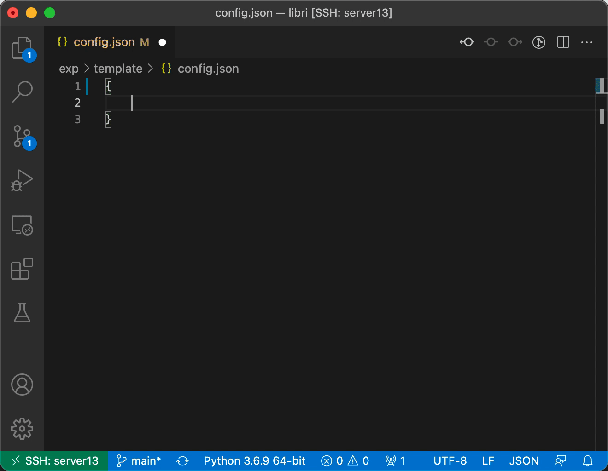

# Transducer toolkit for speech recognition

## In-house SOTA Results 

- [Librispeech](egs/libri): 1.96/4.44, WER% for test-clean/test-other
- [AIshell-1](egs/aishell): 4.69 %CER and 3.67 with extra corpus

## Road Map

- [ ] Internal language model estimation
- [ ] rename `*_process.*` -> `*_pipe.*`
- [ ] \[low priorty\] pythonize n-gram training pipeline

## Installation

0. Clone the repo

    ```bash
    git clone --recurse-submodules git@github.com:maxwellzh/Transducer-dev.git
    ```

1. Install main dependencies
  
   - CUDA compatible machine, NVIDIA driver installed and NVIDIA toolkit available.
   - PyTorch: `>=1.9.0` is recommended
   - Third-party tools:
      - KenLM: refer to the installation [guide](tools/README.md)
      - [CAT](https://github.com/thu-spmi/CAT): **This is optional if you just do language model training.** 
         After installing the CAT, please refers to the details in [tools/README.md](tools/README.md)
        and link directory.
     
         ```bash
         cd tools/
         ln -s <CAT> ./
         ```
   
2. Python packages

   ```bash
   cd Transducer-dev/
   pip install -r requirements.txt
   ```

3. Building packages from source:

   **LM only:**
   
   ```bash
   git submodule init && git submodule update
   cd src/
   
   # gather >= 0.2.1
   cd torch-gather/
   python setup.py install
   ```
   
   **ASR (All functions):**
   
   Please refer to [src/INSTALL](src/INSTALL) for installation instruction.

## Usage

**Data preparation for ASR:**

Currently, this repository is relied on [CAT](https://github.com/thu-spmi/CAT) for data pre-processing, basically the audio features extraction and some of the text normalization.

So, before going into the task, you should do data preparation with CAT first. For more information, please refer to [tools/README.md](tools/README.md).

**Training/inference:**

In this repo, we support RNN-T, Language model and CTC/CTC-CRF model training as well as the inference/decoding.

- **RNN-T:** refer to `egs/<task>/template/` for details. In `egs/<task>/`, run template experiment with

  ```bash
  # cd egs/<task>/
  python utils/asr_process.py exp/template
  ```

- **LM:** refer to `egs/<task>/template/` for details. In `egs/<task>/`, run template experiment with

  ```bash
  # cd egs/<task>/
  python utils/lm_process.py exp/template
  ```

- **CTC:** Training CTC model shares most of the configurations with RNN-T. Set `"topo":"ctc"` in the `hyper-p.json` file to enable CTC training.
 Unfortunately, there's no available template file like RNN-T and LM training. 
 I'll add it soon or later, but that is not on my current schedule.

  ```bash
  # same as RNN-T, cd egs/<task>/
  python utils/asr_process.py exp/template
  ```

### Settings of training

If you're using Visual-Studio Code as working environment, you can setup the json schema for syntax intellisense via (in `egs/<task>/`):

```bash
ln -s ../../.vscode ./
```

Above command would probably raise an error, if there exists a directory `egs/<task>/.vscode`, in such situation, you could manually copy the schema files

```bash
cp ../../.vscode/{hyper_schema,schemas}.json ./.vscode/
```

And add following contents into the file `egs/<task>/.vscode/settings.json`:

```
{
    ...,		// there might be existing settings
    "json.schemas": [
        {
            "fileMatch": [
                "exp/**/config.json"
            ],
            "url": ".vscode/schemas.json"
        },
        {
            "fileMatch": [
                "exp/**/hyper-p.json"
            ],
            "url": ".vscode/hyper_schema.json"
        }
    ]
}
```

With all these properly setup, intellisense will be enable when editting `egs/<task>/<any name>/config.json` and `egs/<task>/<any name>/hyper-p.json`.

For more about how schema works, refer to [JSON editing in Visual Studio Code](https://code.visualstudio.com/docs/languages/json)


  
Also, you can manually check the details of settings as following:

**Global hyper-parameter setting:** `exp/<task>/template/hyper-p.json`, example taken from `egs/libri`

```
{
    "data": {    // data pre-processing related
        "train": ...,
        "dev": ...,
        "test": ...,
        "filter": ":2000",    // for ASR task only, filter out sentences longer than 2000 (frames)
        "text_processing": {  // for LM task only, truncate the sentences by 128 (tokens)
            "truncate": 128
        }
    },
    "sp": {    // SentencePiece model training related, for supported options, refer to:
               // https://github.com/google/sentencepiece/blob/master/doc/options.md 
        ...
    },
    "train": {    // NN training related setting, for supported options (in egs/<task>/):
                  // for RNN-T task, run 'python -m cat.rnnt -h'
                  // for CTC task, run 'python -m cat.ctc -h'
                  // for LM task, run 'python -m cat.lm -h'
        ...
    },
    "inference": {    // for ASR only, decoding related setting
        "avgmodel": {        // model averaging setting, optional
            "mode": "best",  // 'best' of 'last'
            "num": 10        // number of checkpoints to be averaged
        },
        "subsample": 4,      // optional, tell the subsampling factor of RNN-T encoder
        "decode": {   // decoding setting, for support options (in egs/<task>/):
                      // RNN-T: run 'python -m cat.rnnt.decode -h'
                      // CTC: run 'python -m cat.ctc.decode -h'
            ...
        },
        "er": {		// WER/CER computing setting
            "mode": "wer",		// 'wer' or 'cer'
            "oracle": true		// compute oracle wer for N-best list or not
        }
    },
    // the git commit hash, useful to reproduce the experiment
    "commit": "60aa5175c9630bcb5ea1790444732fc948b05865"
}
```

**NN configuration:** `exp/<task>/template/config.json`, example taken from `egs/libri`

```
{
    "specaug_config": {
      // for ASR only, check class 'SpecAug' in cat/shared/_specaug.py for details
        ...
    },
    "transducer": {
      // for RNN-T only, check class 'TransducerTrainer' in cat/rnnt/train.py for details
        ...
    },
    "joint": {	// for RNN-T only
        "type": ...,   // can be any of modules in cat/rnnt/__init__.py
        "kwargs": {    // setting according to 'type'
            ...
        }
    },
    "encoder": {	// for ASR only
        "type": ...,   // can be any of derived classes of 'AbsEncoder' in cat/shared/encoder.py
        "kwargs": {    // setting according to 'type'
            ...
        }
    },
    "decoder": {	// for both RNN-T and LM
        "type": ...,   // can be any of derived classes of 'AbsDecoder' in cat/shared/decoder.py 
        "kwargs": {
            ...
        }
    },
    "scheduler": {	// scheduler setting
        "type": ...,   // can be any of derived classes of `Scheduler` in cat/shared/scheduler.py
        "kwargs": {    // setting according to 'type'
            ...
        },
        "optimizer": {  // optimizer settings
            "type": ...,       // all available ones in torch.optim
            "use_zero": true,  // flag of whether use ZeroRedundancyOptimizer for less memory usage.
            "kwargs": {        // setting according to 'type'
                ...
            }
        }
    }
}
```

