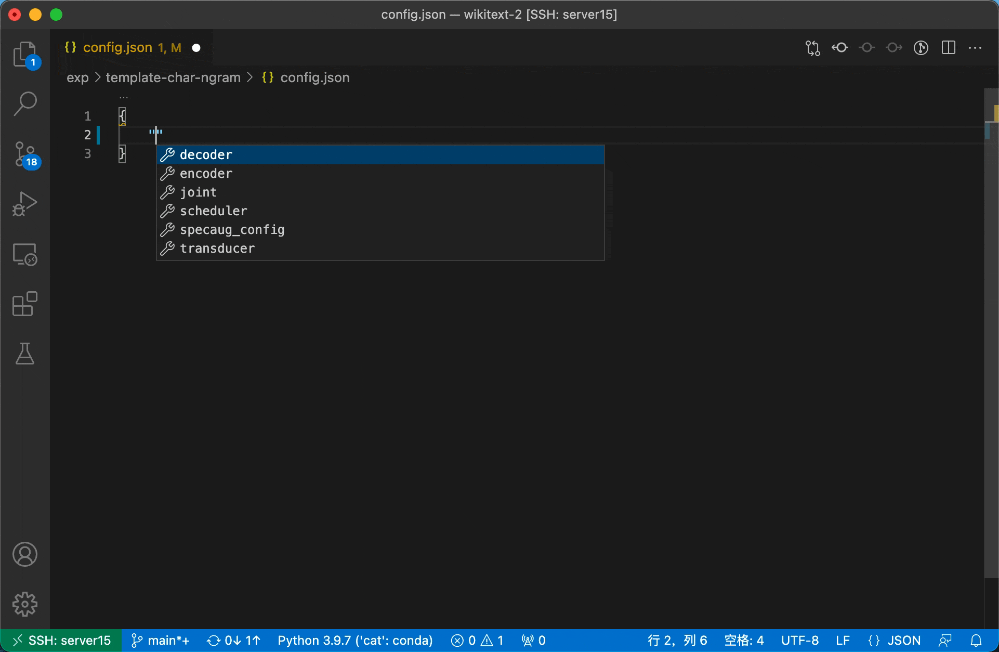

# Transducer toolkit for speech recognition

## In-house SOTA Results 

- [Librispeech](egs/libri): 1.96/4.44, WER% for test-clean/test-other
- [AIshell-1](egs/aishell): 4.69 | 3.67 with extra corpus, CER%

## Installation

1. Install main dependencies
  
   - CUDA compatible machine, NVIDIA driver installed and NVIDIA toolkit available.
   - PyTorch: `>=1.9.0` is recommended
   - [CAT](https://github.com/thu-spmi/CAT): **This is optional if you just do language model training.** 
      After installing the CAT, please refers to the details in [tools/README.md](tools/README.md)
     and link directory.
     
      ```bash
      cd tools/
      ln -s <CAT> ./
      ```
   
2. Python packages

   ```bash
   git clone git@github.com:maxwellzh/Transducer-dev.git
   cd Transducer-dev/
   pip install -r requirements.txt
   ```

3. Building packages from source:

   **LM only:**
   
   ```bash
   git submodule init && git submodule update
   cd src/
   
   # gather >= 0.2.1
   cd torch-gather/
   python setup.py install
   ```
   
   **ASR:**
   
   ```bash
   git submodule init && git submodule update
   cd src/
   
   # warp-rnnt >= 0.7.0
   cd warp-rnnt/pytorch_binding/
   git checkout -t origin/dev
   python setup.py install
   cd ../../
   
   # gather >= 0.2.1
   cd torch-gather/
   python setup.py install
   ```

## Usage

**Data preparation:**

Currently, this repository is relied on [CAT](https://github.com/thu-spmi/CAT) for data pre-processing, basically the audio features extraction and some of the text normalization.

So, before going into the task, you should do data preparation with CAT first. For more information, please refer to [tools/README.md](tools/README.md).

**Training/inference:**

In this repo, we support RNN-T, Language model and CTC/CTC-CRF model training as well as the inference/decoding.

- **RNN-T:** refer to `egs/<task>/template/` for details. In `egs/<task>/`, run template experiment with

  ```bash
  # cd egs/<task>/
  python utils/asr_process.py exp/template
  ```

- **LM:** refer to `egs/<task>/template/` for details. In `egs/<task>/`, run template experiment with

  ```bash
  # cd egs/<task>/
  python utils/lm_process.py exp/template
  ```

- **CTC/CTC-CRF:** this can be regarded as a replica of CAT, but with better and pretty training procedure monitoring. Unfortunately, there's no available `ctc_process.py` like RNN-T and LM training. I'll add it in the future, but that is not on my current schedule. And training CTC/CTC-CRF requires the `ctc_crf` to be installed. Refer to CAT installation for more details.

**Global hyper-parameter setting:**`exp/<task>/template/hyper-p.json`, example taken from `egs/libri`

```
{
    "data": {    // data pre-processing related
        "train": ...,
        "dev": ...,
        "test": ...,
        "filter": ":2000",    // for ASR task only, filter out sentences longer than 2000 (frames)
        "text_processing": {  // for LM task only, truncate the sentences by 128 (tokens)
            "truncate": 128
        }
    },
    "sp": {    // SentencePiece model training related, for supported options, refer to:
               // https://github.com/google/sentencepiece/blob/master/doc/options.md 
        ...
    },
    "train": {    // NN training related setting, for supported options:
                  // in egs/<task>/, run 'python -m cat.rnnt -h' or 'python -m cat.lm -h'
        ...
    },
    "inference": {    // for RNN-T only, decoding related setting
        "avgmodel": {        // model averaging setting, optional
            "mode": "best",  // 'best' of 'last'
            "num": 10        // number of checkpoints to be averaged
        },
        "subsample": 4,      // tell the subsampling factor of RNN-T encoder, optional
        "decode": {   // decoding setting, for support options
                      // in egs/<task>/, run 'python -m cat.rnnt.decode -h'
            ...
        },
        "er": {		// WER/CER computing setting
            "mode": "wer",		// 'wer' or 'cer'
            "oracle": true		// compute oracle wer for N-best list or not
        }
    },
  	// the git commit hash, useful to reproduce the experiment
    "commit": "60aa5175c9630bcb5ea1790444732fc948b05865"
}
```

**NN configuration:	**`exp/<task>/template/config.json`

- If you have installed all dependencies (including `warp-rnnt` and `torch-gather`), and you're using Visual-Studio Code as working environment, you can generate json schema for syntax intellisense via (in `egs/<task>/`):

  ```bash
  python -m cat.rnnt.parseschema
  ```

  It would auto-generate a file `.vscode/schemas.json`. Add following contents into the file `.vscode/settings.json`:

  ```
  {
  		...,		// there might be existing settings
      "json.schemas": [
          {
              "fileMatch": [
                  "exp/**/config.json"
              ],
              "url": ".vscode/schemas.json"
          }
      ]
  }
  ```

  With all these properly setup, intellisense will be enable when editting `egs/<task>/<any name>/config.json`. For more details, refer to [JSON editing in Visual Studio Code](https://code.visualstudio.com/docs/languages/json)

  
  
- Also, you can check the details of settings as following

```
{
    "specaug_config": {
      // for ASR only, check class 'SpecAug' in cat/shared/_specaug.py for details
        ...
    },
    "transducer": {
      // for RNN-T only, check class 'TransducerTrainer' in cat/rnnt/train.py for details
        ...
    },
    "joint": {	// for RNN-T only
        "type": ...,   // can be any of modules in cat/rnnt/__init__.py
        "kwargs": {    // setting according to 'type'
            ...
        }
    },
    "encoder": {	// for RNN-T only
        "type": ...,   // can be any of modules in cat/shared/encoder.py
        "kwargs": {    // setting according to 'type'
            ...
        }
    },
    "decoder": {	// for both RNN-T and LM
        "type": ...,   // can be any of derived classes of 'AbsDecoder' in cat/shared/decoder.py 
        "kwargs": {
            ...
        }
    },
    "scheduler": {	// scheduler setting
        "type": ...,   // can be any of derived classes of `Scheduler` in cat/shared/scheduler.py
        "kwargs": {    // setting according to 'type'
            ...
        },
        "optimizer": {  // optimizer settings
            "type": ...,       // all available ones in torch.optim
            "use_zero": true,  // flag of whether use ZeroRedundancyOptimizer for less memory usage.
            "kwargs": {        // setting according to 'type'
                ...
            }
        }
    }
}
```

