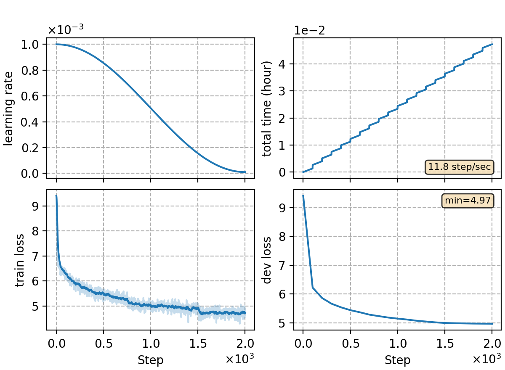

### Basic info

**This part is auto-generated, add your details in Appendix**

* \# of parameters (million): 8.55
* GPU info \[1\]
  * \[1\] NVIDIA GeForce RTX 3090

### Notes

* template experiment training a Transformer LM on PTB.

### Result

```
Test file: data/local-lm/ptb.test.txt -> ppl: 136.56
Test file: data/local-lm/ptb.valid.txt -> ppl: 142.94
```

|     training process    |
|:-----------------------:|
||
