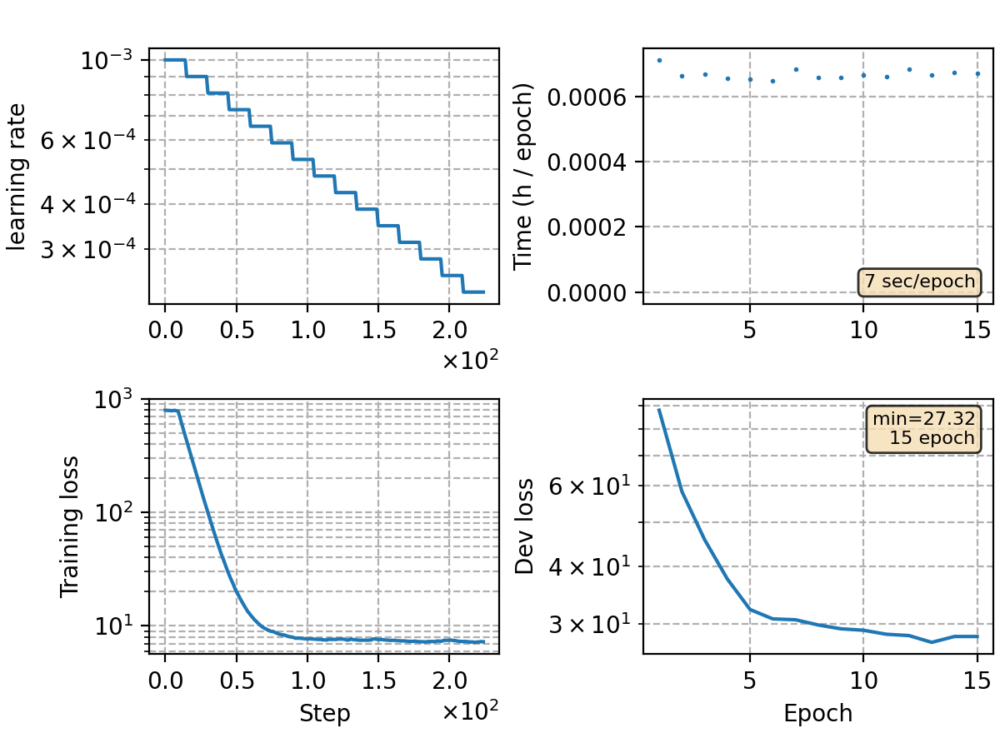

### Basic info

**This part is auto-generated, add your details in Appendix**

* Model size/M: 3.20
* GPU info \[1\]
  * \[1\] NVIDIA GeForce RTX 3090

### Appendix

* template experiment using RNN-T loss to train on the yesno data.

### Result
```
# failed to train RNN-T on yesno
yesno   %SER 100.00 | %WER 66.04 [ 317 / 480, 0 ins, 308 del, 9 sub ]
```

### Monitor figure

