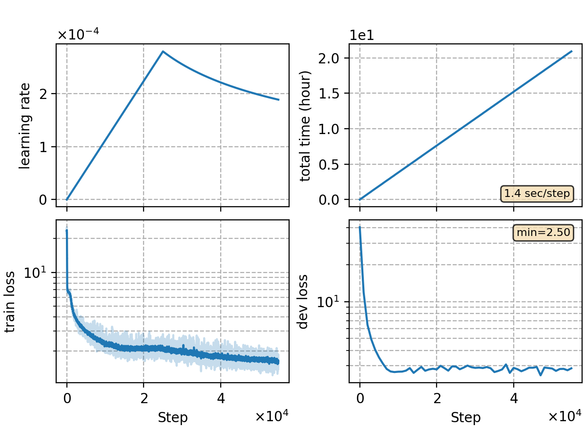

### Basic info

**This part is auto-generated, add your details in Appendix**

* \# of parameters (million): 117.07
* GPU info \[10\]
  * \[10\] NVIDIA GeForce RTX 3090

### Notes

* CTC-CUSIDE experiment,training 40 epochs 
* In decoding, a word-level 3-gram language model (LM) trained on the transcripts is used to build the decoding WFST.

### Result
```
%CER 7.17 [ 1494 / 20850, 9 ins, 48 del, 1437 sub ] [PARTIAL] exp/catv3/ctc/cer_8_0.0
```

|     training process    |
|:-----------------------:|
||
