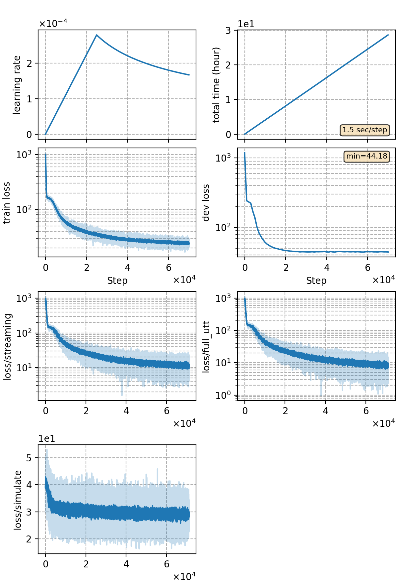

### Basic info

**This part is auto-generated, add your details in Appendix**

* \# of parameters (million): 86.00
* GPU info \[10\]
  * \[10\] NVIDIA GeForce RTX 3090

### Notes

* RNN-T-CUSIDE experiment,training 50 epochs

### Result
```
test    %SER 41.76 | %CER 6.02 [ 6302 / 104765, 225 ins, 255 del, 5822 sub ]-streaming
test    %SER 36.97 | %CER 5.12 [ 5369 / 104765, 102 ins, 180 del, 5087 sub ]-w/o-streaming
```

|     training process    |
|:-----------------------:|
||
