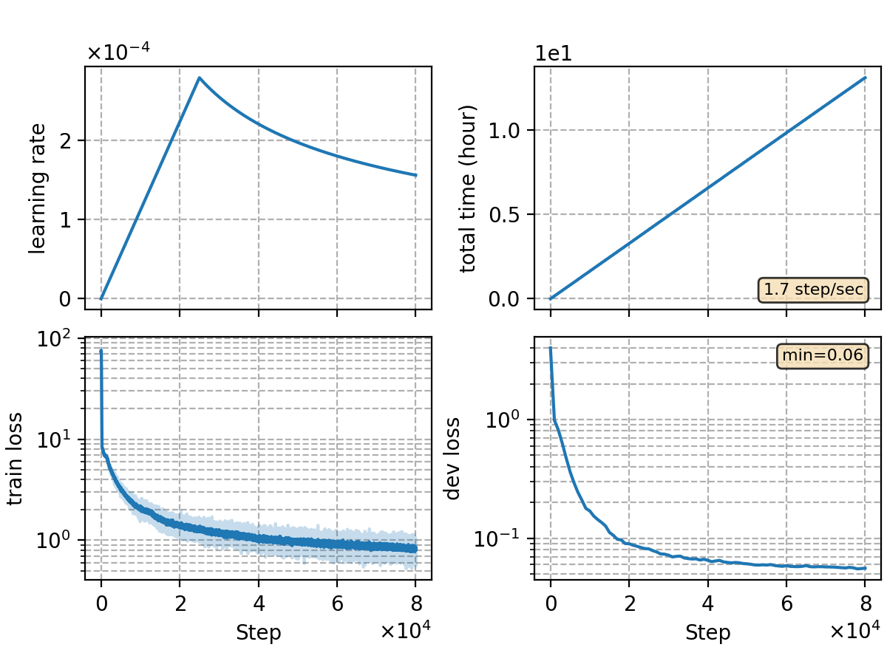

### Basic info

**This part is auto-generated, add your details in Appendix**

* \# of parameters (million): 79.50
* GPU info \[8\]
  * \[8\] NVIDIA GeForce RTX 3090

### Notes

* use the same encoder as `rnnt/rnnt-v15`

### Result
```
dev     %SER 40.00 | %CER 5.26 [ 10798 / 205341, 164 ins, 199 del, 10435 sub ]
test    %SER 42.22 | %CER 5.76 [ 6031 / 104765, 95 ins, 147 del, 5789 sub ]
```

|     training process    |
|:-----------------------:|
||
