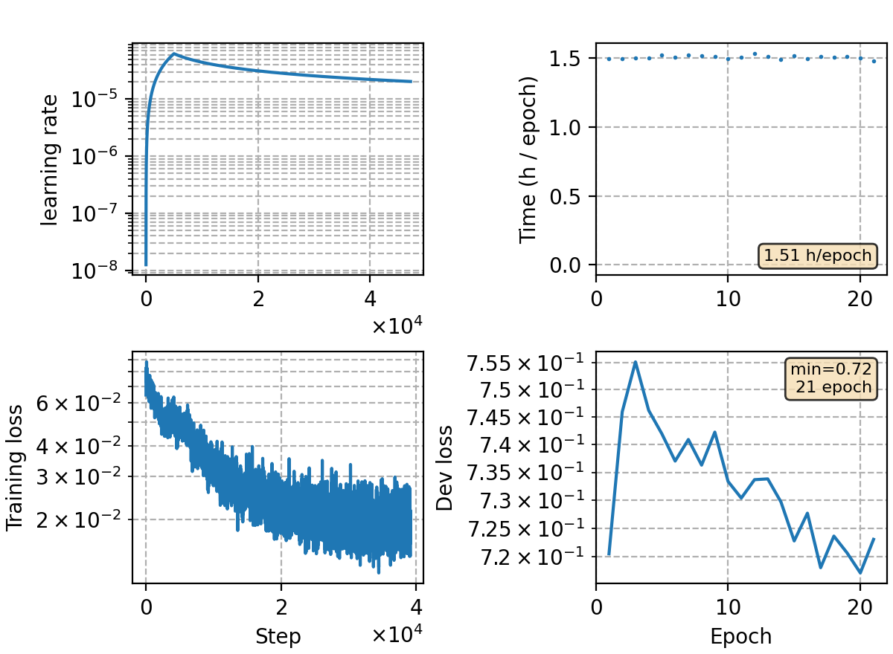

### Basic info

**This part is auto-generated, add your details in Appendix**

* Model size/M: 84.30
* GPU info \[10\]
  * \[10\] NVIDIA GeForce RTX 3090

### Appendix

* MWER training with fully on-the-fly decoding

### Result
```
avg 5
dev     %SER 34.91 | %CER 4.56 [ 9356 / 205341, 146 ins, 308 del, 8902 sub ]
test    %SER 36.87 | %CER 5.02 [ 5263 / 104765, 77 ins, 222 del, 4964 sub ]
```

### Monitor figure

