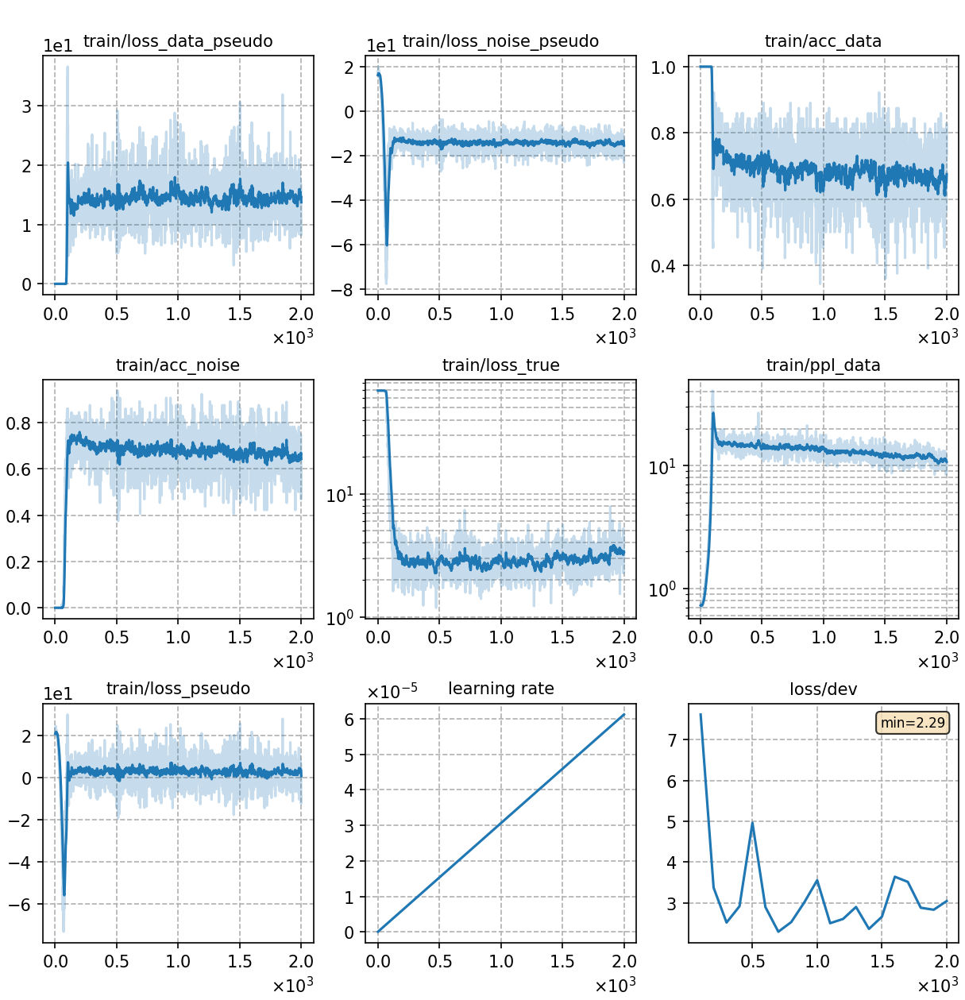

# Train GN-ELM with DNCE
We use the [LM pipeline](../../README.md) to train the Globally Normalized Energy-based Lanuage Model (GN-ELM) with [DNCE](https://ieeexplore.ieee.org/abstract/document/8639591/).
```
python utils/pipeline/lm.py exp/lm/GN-ELM-DNCE --stop 2 --ngpu 4
mv exp/lm/GN-ELM-DNCE/pkl exp/lm/GN-ELM-DNCE/pkl0
python utils/reprocess.py exp/lm/GN-ELM-DNCE/pkl0 exp/lm/GN-ELM-DNCE/pkl --head_del 1
python utils/pipeline/lm.py exp/lm/GN-ELM-DNCE --start 3 --ngpu 4
```
The pipeline includes 4 stages:
```
(data prepare) ->
tokenizer training -> data packing -> nn training -> inference
```

## Notes

* In stage 2 (data packing), if you use a `PretrainedTokenizer` of type `BertTokenizer` to tokenize the data, the start token *[CLS]* and end token *[SEP]* will be added at the beginning and end of each sentence automatically. This is incompatible with the pipeline since the pipeline will automatically add another start token *0* at the beginning. So we need to **delete the duplicated start token** after packing data (the two commands in the middle above).
* You can set **different energy function** in  `config['decoder']['kwargs']['energy_func']`, including 'sumtargetlogit', 'hidden2scalar-sum', 'sumtokenlogit' and so on. Note that different energy functions require **different backbones**, which can be in [config_ebm.json](./config_ebm.json). Besides, we need to use an additional language model to generate noise samples, whose structure is specified in [config_noise.json](./config_noise.json).
* For other **ELM experiments with different settings**, we follow the same training framework above and only modify some configurations.
Please refer to
  - [Train GN-ELM with NCE](../GN-ELM-NCE/readme.md)
  - [Train GN-ELM with ML](../GN-ELM-ML/readme.md)
  - [Train TRF-LM with DNCE](../TRF-LM-DNCE/readme.md)
* The experiments are conducted on AISHELL-1. For **experiments on WenetSpeech**, please refer to [WenetSpeech exp](../../../../wenetspeech/exp/lm/GN-ELM-DNCE/readme.md).


## Result
The trained GN-ELM is capable of rescoring ASR outputs. We rescore two N-best lists generated by [aishell-rnnt-v19](../../../exp/rnnt/rnnt-v19-torchaudio/readme.md) (in-domain testing) and [wenet-rnnt-v4](../../../../wenetspeech/exp/rnnt/rnnt-v4/readme.md) (cross-domain testing). The N-best lists can be downloaded from [in-domain.nbest](https://cat-ckpt.oss-cn-beijing.aliyuncs.com/liuhong/aishell/in-domain.nbest?OSSAccessKeyId=LTAI5t5b3q2Ls6sbkYcEABua&Expires=1670832231&Signature=6fVIiJ60xGZBChI3a20sz8q35uQ%3D) and [cross-domain.nbest](https://cat-ckpt.oss-cn-beijing.aliyuncs.com/liuhong/aishell/cross-domain.nbest?OSSAccessKeyId=LTAI5t5b3q2Ls6sbkYcEABua&Expires=1670832163&Signature=fZAu%2FNrQnGei6MdbJg8Uxbt5vwE%3D).
We use [lmweight_search.py](../../../../../cat/utils/lm/lmweight_search.py) to search the best `alpha` and `beta` on dev set, then we use the searched parameters to interpolate the scores of ASR model with the scores of ELM on test set. The script [rescore_aishell.sh](../../../../../cat/utils/rescore_aishell.sh) performs an integrated testing process, where you need to specify the score files of ASR model, LM model and sentence length on dev and test set respectively.

We try 3 different energy functions mentioned in the second note. The backbone of 'sumtargetlogit' is GPT-2, while that of the other two functions is BERT. The results are as follows:

|CER type     | SumTargetLogit |  Hidden2Scalar  | SumTokenLogit |
| -------     | -------- | ----------- | ----------- |
| in-domain   | 3.25     |  3.11       |  3.15       |
| cross-domain| 3.40     |  3.34       |  3.43       | 

### Significance Test
If you want to determine whether there is a significant difference between two models statistically, please refer to [significance test](../../../../../cat/utils/significance_test.md).

'Hidden2Scalar' achieves the best results and the training curve is as follows:
|     training curve    |
|:-----------------------:|
||
