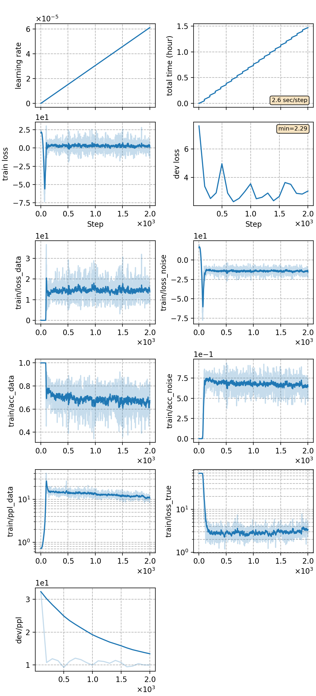

## Train EBM with DNCE
We use the [LM pipeline](../../README.md) to train the energy based lanuage model with [DNCE](https://ieeexplore.ieee.org/abstract/document/8639591/).
```
python utils/pipeline/lm.py exp/lm/debm --ngpu 4
```
The pipeline includes 4 stages:
```
(data prepare) ->
tokenizer training -> data packing -> nn training -> inference
```

### Notes

* In **stage 2 (data packing)**, if you use a `PretrainedTokenizer` of type `BertTokenizer` to tokenize the data, the start token *[CLS]* and end token *[SEP]* will be added at the beginning and end of each sentence automatically. This is incompatible with the pipeline since the pipeline will automatically add another start token *0* at the beginning. So we need to delete the duplicated start token after packing data
```
mv exp/lm/ebm-dnce/lmbin exp/lm/ebm-dnce/lmbin0
python utils/reprocess.py exp/lm/ebm-dnce/lmbin0 exp/lm/ebm-dnce/lmbin --head_del 1
```
* The structure of the EBM is specified in [config_ebm.json](./config_ebm.json). Besides, we need to use an additional language model to generate noise samples, whose structure is specified in [config_noise.json](./config_noise.json).
* For other **EBM experiments with different settings**, we follow the same training framework above with only some details different.
Please refers to
  - [Train EBM with NCE](../ebm-nce/readme.md)
  - [Train TRF with DNCE](../trf-dnce/readme.md)


### Result
The trained EBM is capable of rescoring ASR outputs. We rescore two N-best lists generated by [aishell-rnnt-v19](../../../exp/rnnt/rnnt-v19-torchaudio/readme.md) (in-domain testing) and [wenet-rnnt-v4](../../../../wenetspeech/exp/rnnt/rnnt-v4/readme.md) (cross-domain testing). The N-best lists can be downloaded from [in-domain.nbest](https://cat-ckpt.oss-cn-beijing.aliyuncs.com/liuhong/aishell/in-domain.nbest?OSSAccessKeyId=LTAI5t5b3q2Ls6sbkYcEABua&Expires=1670832231&Signature=6fVIiJ60xGZBChI3a20sz8q35uQ%3D) and [cross-domain.nbest](https://cat-ckpt.oss-cn-beijing.aliyuncs.com/liuhong/aishell/cross-domain.nbest?OSSAccessKeyId=LTAI5t5b3q2Ls6sbkYcEABua&Expires=1670832163&Signature=fZAu%2FNrQnGei6MdbJg8Uxbt5vwE%3D).
We use [lmweight_search](../../../utils/lm/lmweight_search.py) to search `alpha` and `beta` during rescoring. 

We tried two different structures of EBM. The results are as follows:

|CER type     | BERT EBM |  GPT-2 EBM  |
| -------     | -------- | ----------- |
| in-domain   | 3.10     |  3.25       | 
| cross-domain| 3.31     |  3.39       | 


|     training process    |
|:-----------------------:|
||
