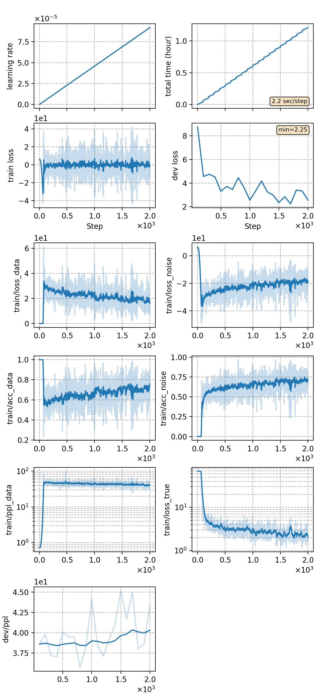

## Train EBM with NCE
### Notes
* **Before stage 3 (nn training)**, we need a trained language model to initialize the noise model. We use a [GPT-2 LM fine-tuned on aishell](../lm-gpt2/). The checkpoint path to be loaded is specified in `config['decoder']['kwargs']['check_noise_model']`.

### Result

|CER type     | BERT EBM |  GPT-2 EBM  |
| -------     | -------- | ----------- |
| in-domain   | 3.19     |  3.27       | 
| cross-domain| 3.36     |  3.39       | 

|     training process    |
|:-----------------------:|
||
