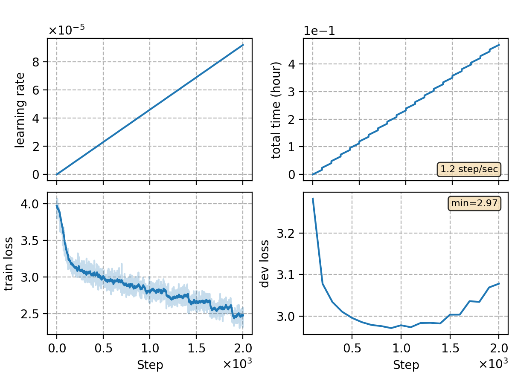

## Fine-tune GPT-2
We use the [LM pipeline](../../README.md) to fine-tune GPT-2 on aishell.
```
python utils/pipeline/lm.py exp/lm/lm-gpt2 --ngpu 4
```
The pipeline includes 4 stages:
```
(data prepare) ->
tokenizer training -> data packing -> nn training -> inference
```

### Notes

* In **stage 2 (data packing)**, if you use a `PretrainedTokenizer` of type `BertTokenizer` to tokenize the data, the start token *[CLS]* and end token *[SEP]* will be added at the beginning and end of each sentence automatically. This is incompatible with the pipeline since the pipeline will automatically add another start token *0* at the beginning. So we need to delete the duplicated start token after packing data
```
mv exp/lm/lm-gpt2/lmbin exp/lm/lm-gpt2/lmbin0
python utils/reprocess.py exp/lm/lm-gpt2/lmbin0 exp/lm/lm-gpt2/lmbin --head_del 1
```

### Result
|CER type     | GPT-2 |  GPT-2 after fine-tuning  |
| -------     | -------- | ----------- |
| in-domain   | 3.23     |  3.11       | 
| cross-domain| 3.67     |  3.33       | 

|     training process    |
|:-----------------------:|
||
