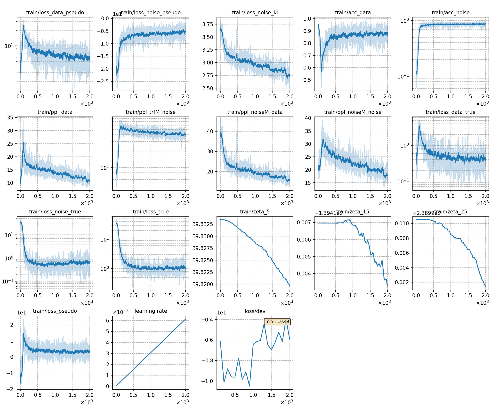

## Train TRF with DNCE
### Notes
* **In stage 2 (data packing)**, for training TRF, we need to calculate the length distribution after packing data and before training.
```
python -m cat.lm.trf.prep_feats exp/[your_exp]/lmbin/train.pkl exp/[your_exp]/linfo.pkl
```

### Result

|CER type     | BERT TRF |  GPT-2 TRF  |
| -------     | -------- | ----------- |
| in-domain   | 3.13     |  3.10       | 
| cross-domain| 3.38     |  3.44       | 

|     training process    |
|:-----------------------:|
||
