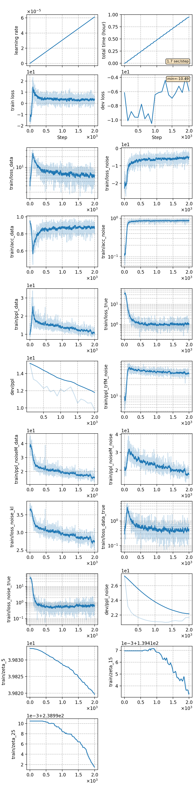

## Train TRFLM with DNCE
We use the [LM pipeline](../../README.md) to train [the trains-dimensional energy based lanuage model (TRFLM)](https://arxiv.org/abs/1707.07240) with [DNCE](https://ieeexplore.ieee.org/abstract/document/8639591/).
```
python utils/pipeline/lm.py exp/lm/trflm --ngpu 4
```
The pipeline includes 4 stages:
```
(data prepare) ->
tokenizer training -> data packing -> nn training -> inference
```

### Notes

* **In stage 2 (data packing)**, if you use a `PretrainedTokenizer` of type `BertTokenizer` to tokenize the data, the start token *[CLS]* and end token *[SEP]* will be added at the beginning and end of each sentence automatically. This is incompatible with the pipeline since the pipeline will automatically add another start token *0* at the beginning. So we need to delete the duplicated start token after packing data
```
python utils/reprocess.py exp/[your_exp]/lmbin exp/[your_exp]/lmbin --head_del 1
```
* **In stage 2 (data packing)**, for training TRFLM, we need to calculate the length distribution after packing data and before training.
```
python -m cat.lm.trf.prep_feats exp/[your_exp]/lmbin/train.pkl exp/[your_exp]/linfo.pkl
```
* The structure of the TRFLM is specified in [config_ebm.json](./config_ebm.json). Besides, we need to use an additional language model to generate noise samples, whose structure is specified in [config_noise.json](./config_noise.json).

### Result
The trained TRFLM is capable of rescoring ASR outputs. We rescore two N-best lists generated by [aishell-rnnt-v19](../../../exp/rnnt/rnnt-v19-torchaudio/readme.md) (in-domain testing) and [wenet-rnnt-v4](../../../../wenetspeech/exp/rnnt/rnnt-v4/readme.md) (cross-domain testing)
```
in-domain cer: 3.10
cross-domain cer: 3.44
```

|     training process    |
|:-----------------------:|
||
