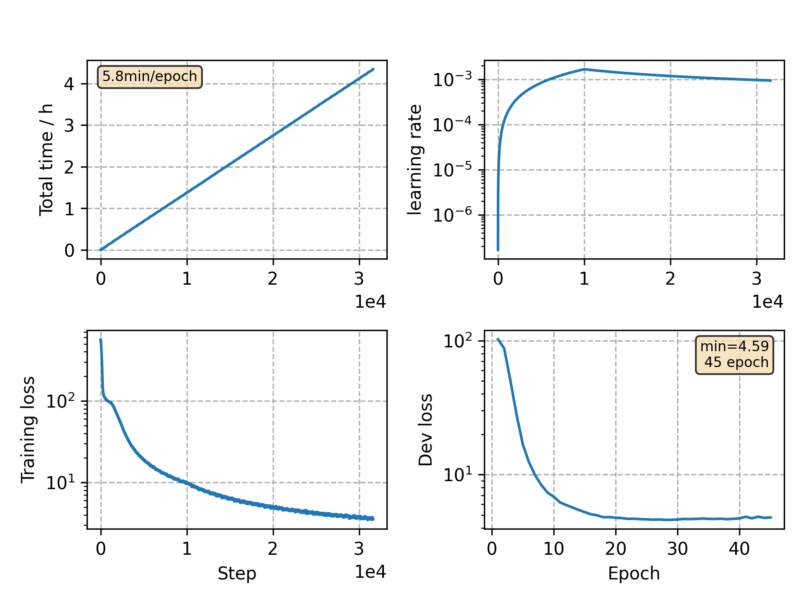

### Basic info

**This part is auto generated, add your details in Appendix**

* Model size/M: 11.92
* GPU info \[9\]
  * \[9\] GeForce RTX 3090

### Appendix

* 

### WER
```
no model averaging
test    %CER 7.73 [8103 / 104765, 204 ins, 208 del, 7691 sub ]
test    %CER 5.89 [6169 / 104765, 123 ins, 173 del, 5873 sub ]
```

### Monitor figure

