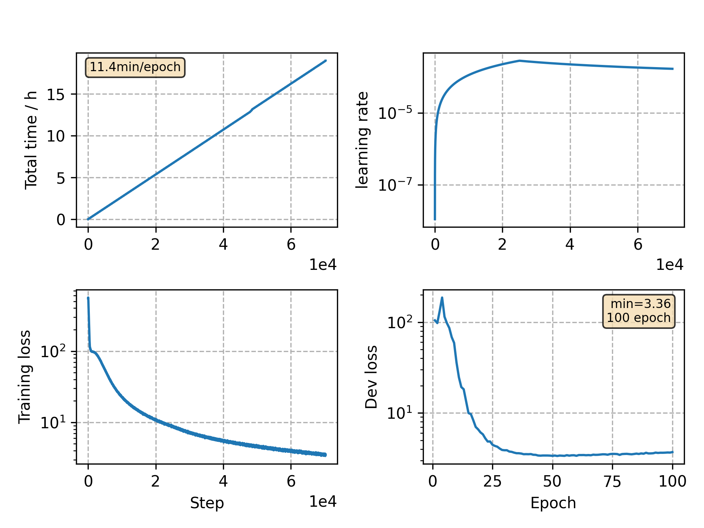

### Basic info

**This part is auto generated, add your details in Appendix**

* Model size/M: 90.33
* GPU info \[9\]
  * \[9\] GeForce RTX 3090

### Appendix

* `v5` + rm spaces in transcript

### WER
```
test    %CER 5.23 [5474 / 104765, 190 ins, 127 del, 5157 sub ]
test    %CER 4.00 [4189 / 104765, 120 ins, 111 del, 3958 sub ]
```

### Monitor figure

