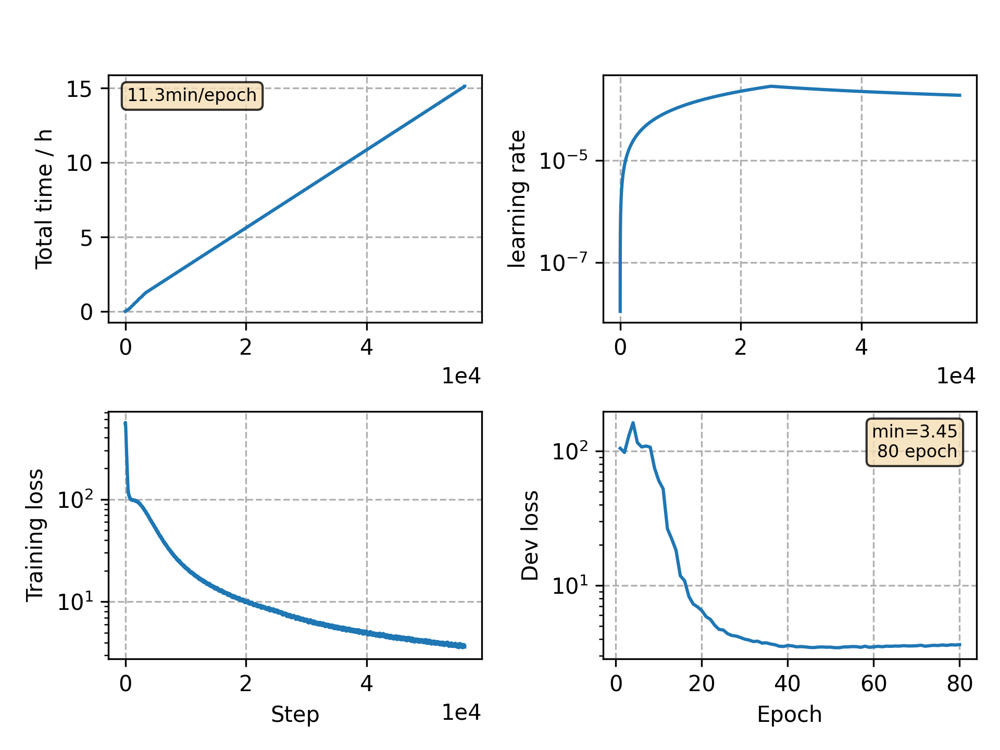

### Basic info

**This part is auto generated, add your details in Appendix**

* Model size/M: 90.33
* GPU info \[9\]
  * \[9\] GeForce RTX 3090

### Appendix

* `v10` + disable time warp, stop at 80 epochs

### WER
```
Use CPU = False
test ext_lm= %CER 5.91 [6187 / 104765, 179 ins, 187 del, 5821 sub ]

Custom checkpoint: avg_best_10.pt
Use CPU = False
test ext_lm= %CER 5.24 [5489 / 104765, 173 ins, 133 del, 5183 sub ]

Custom checkpoint: avg_last_10.pt
Use CPU = False
test ext_lm= %CER 5.25 [5498 / 104765, 119 ins, 207 del, 5172 sub ]
```

### Monitor figure

