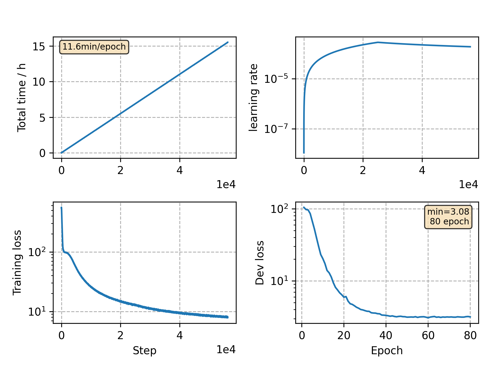

### Basic info

**This part is auto generated, add your details in Appendix**

* Model size/M: 90.33
* GPU info \[9\]
  * \[9\] GeForce RTX 3090

### Appendix

* `v10` + prediction network mask, stop epochs: 100 -> 80

### WER
```
test    %CER 4.86 [5096 / 104765, 127 ins, 156 del, 4813 sub ]
test    %CER 3.46 [3623 / 104765, 82 ins, 134 del, 3407 sub ]
```

### Monitor figure

