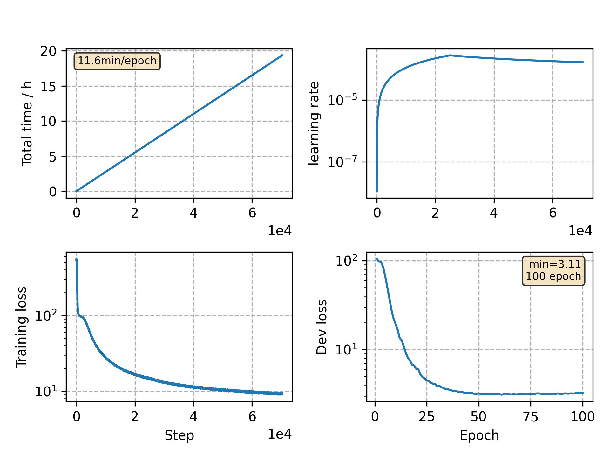

### Basic info

**This part is auto generated, add your details in Appendix**

* Model size/M: 90.33
* GPU info \[9\]
  * \[9\] GeForce RTX 3090

### Appendix

* `v12` + PN mask ratio: 0.2 -> 0.3, No. PN mask: 4 -> 3, stop epochs: 80 -> 100

### WER
```
Use CPU = False
test ext_lm= %CER 5.41 [5663 / 104765, 168 ins, 168 del, 5327 sub ]

Custom checkpoint: avg_best_10.pt
Use CPU = False
test ext_lm= %CER 4.79 [5019 / 104765, 150 ins, 154 del, 4715 sub ]

Custom checkpoint: avg_last_10.pt
Use CPU = False
test ext_lm= %CER 4.89 [5125 / 104765, 111 ins, 183 del, 4831 sub ]
```

### Monitor figure

