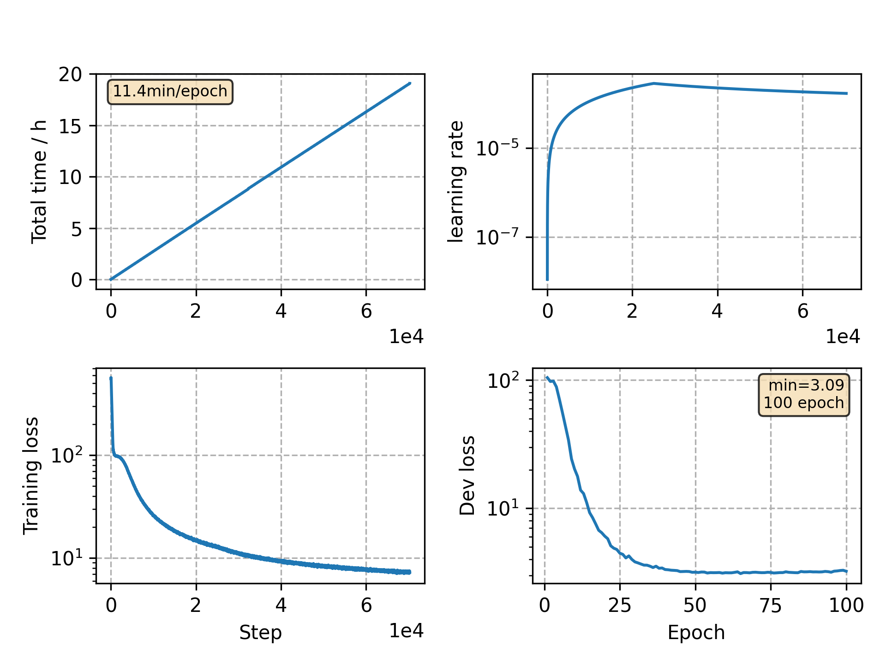

### Basic info

**This part is auto generated, add your details in Appendix**

* Model size/M: 84.30
* GPU info \[9\]
  * \[9\] GeForce RTX 3090

### Appendix

* `v12` + subsample: conv2d -> vgg2l, stop epochs: 80 -> 100

### WER
```
Use CPU = False
test ext_lm= %CER 5.31 [5565 / 104765, 135 ins, 176 del, 5254 sub ]

Custom checkpoint: avg_best_10.pt
Use CPU = False
test ext_lm= %CER 4.77 [4998 / 104765, 118 ins, 137 del, 4743 sub ]

Custom checkpoint: avg_last_10.pt
Use CPU = False
test ext_lm= %CER 4.77 [4993 / 104765, 102 ins, 167 del, 4724 sub ]
```

### Monitor figure

