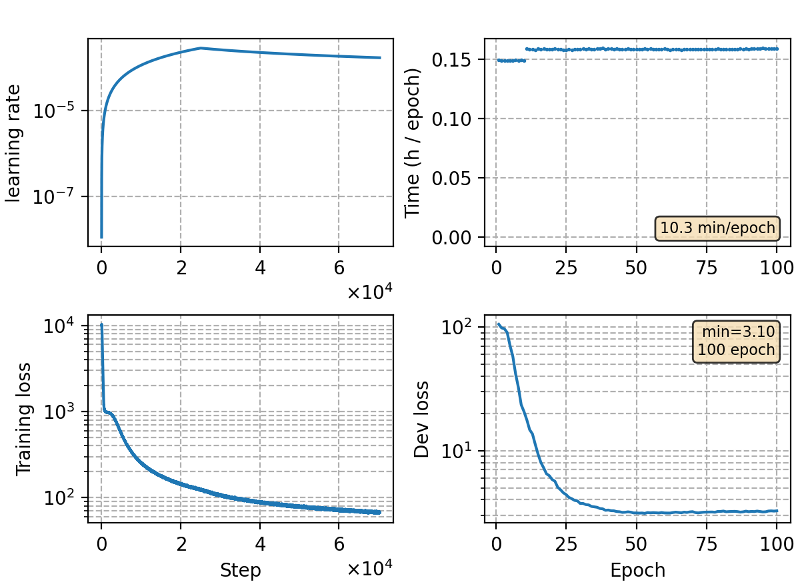

### Basic info

**This part is auto-generated, add your details in Appendix**

* Model size/M: 84.30
* GPU info \[10\]
  * \[10\] NVIDIA GeForce RTX 3090

### Appendix

* `rnnt-v15` + rm time reduction 

### Result
```
dev     %SER 34.38 | %CER 4.48 [ 9201 / 205341, 171 ins, 256 del, 8774 sub ]
test    %SER 36.19 | %CER 4.86 [ 5093 / 104765, 99 ins, 183 del, 4811 sub ]

+lm-v5 (5gram char)
%SER 33.67 | %CER 4.40 [ 9033 / 205341, 192 ins, 214 del, 8627 sub ]    [0.09375, 1.0]
%SER 34.66 | %CER 4.64 [ 4861 / 104765, 102 ins, 184 del, 4575 sub ]    [0.21875, 1.25]

+lm-v6 (3gram word)
%SER 32.00 | %CER 4.21 [ 8647 / 205341, 136 ins, 513 del, 7998 sub ]    [0.15625, -0.5]
%SER 33.01 | %CER 4.46 [ 4669 / 104765, 58 ins, 436 del, 4175 sub ]     [0.125, -1.5]
```

### Monitor figure

