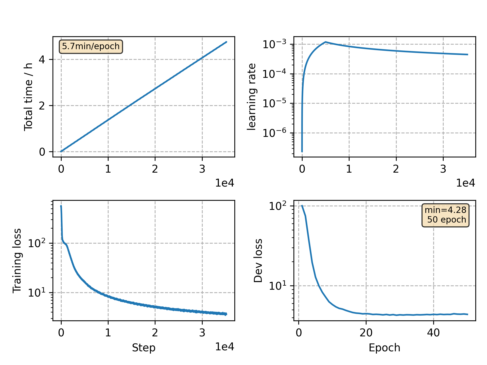

### Basic info

**This part is auto generated, add your details in Appendix**

* Model size/M: 11.92
* GPU info \[9\]
  * \[9\] GeForce RTX 3090

### Appendix

* `v1` with smaller peak factor and less warmup steps
* As the results shown, the model seems overfitting at very early stage.

### WER
```
following result is based on previous api, might have slightly difference
test   %CER 6.58 [6892 / 104765, 153 ins, 190 del, 6549 sub ]
```

### Monitor figure

