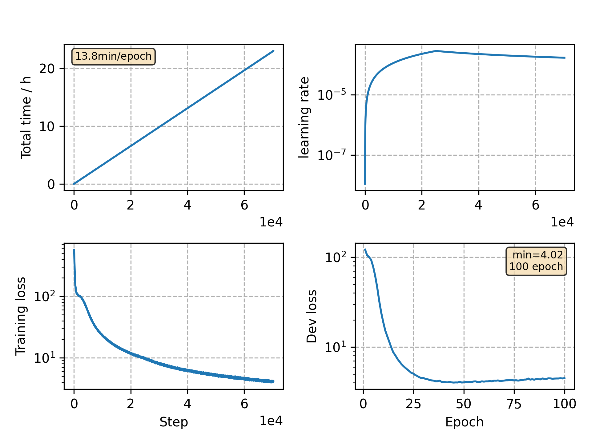

### Basic info

**This part is auto generated, add your details in Appendix**

* Model size/M: 89.58
* GPU info \[9\]
  * \[9\] GeForce RTX 3090

### Appendix

* settings refers to [ESPNET aishell](https://github.com/espnet/espnet/blob/master/egs/aishell/asr1/RESULTS.md#conformer-transducer)

### WER
```
test    %CER 5.32 [5574 / 104765, 154 ins, 120 del, 5300 sub ]
test    %CER 4.02 [4215 / 104765, 98 ins, 109 del, 4008 sub ]
```

### Monitor figure

