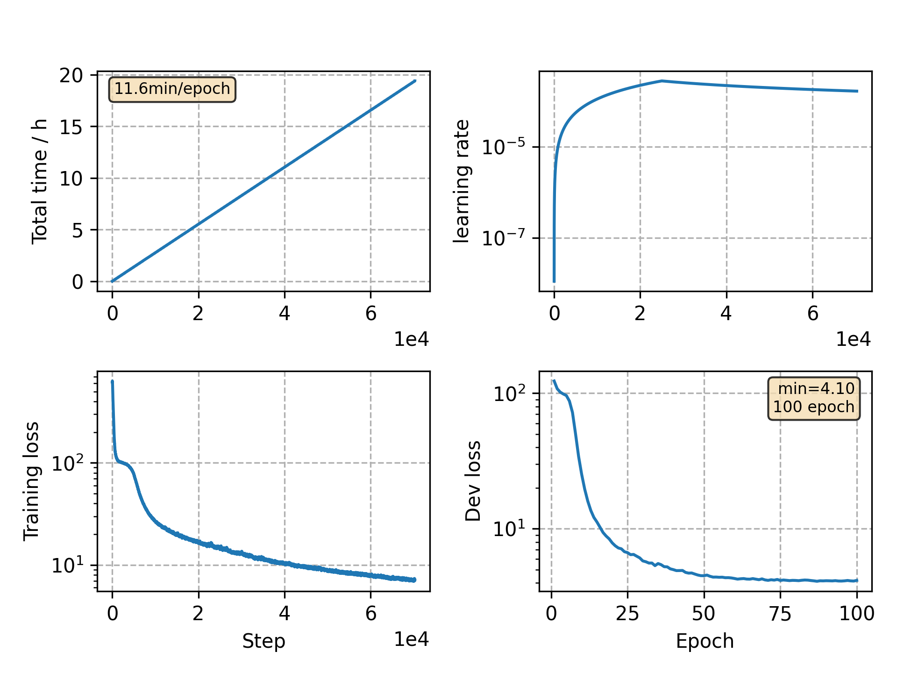

### Basic info

**This part is auto generated, add your details in Appendix**

* Model size/M: 90.33
* GPU info \[9\]
  * \[9\] GeForce RTX 3090

### Appendix

* `v3` + char modeling, gradient clipping and attention dropout

### WER
```
test    %CER 6.13 [6421 / 104765, 143 ins, 135 del, 6143 sub ]
test    %CER 4.01 [4204 / 104765, 89 ins, 122 del, 3993 sub ]
```

### Monitor figure

