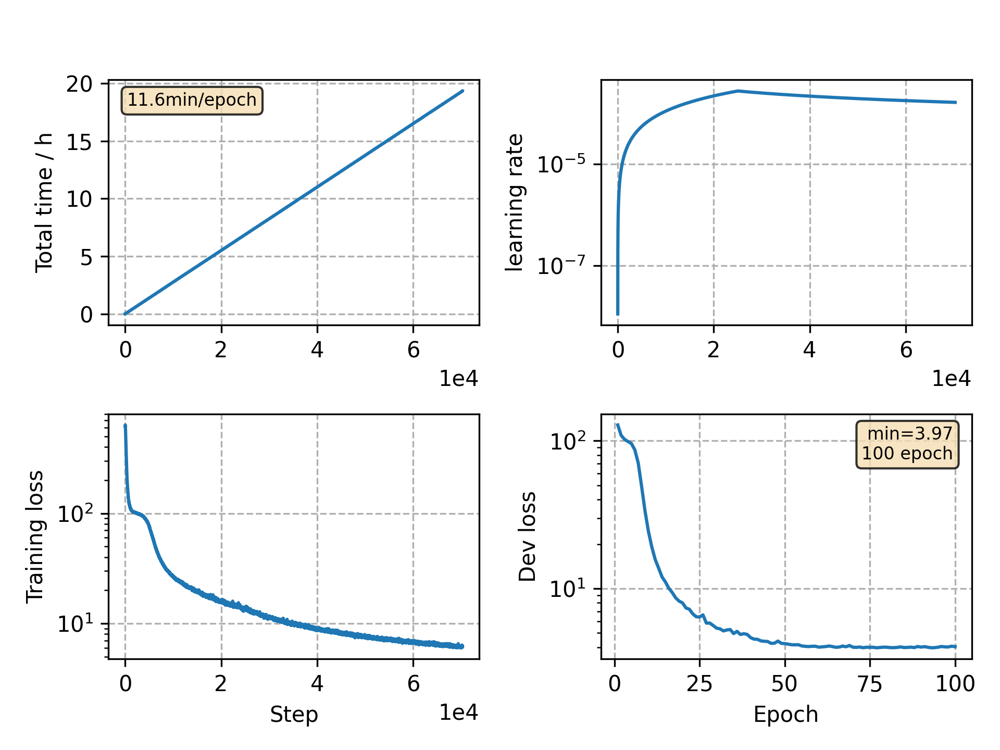

### Basic info

**This part is auto generated, add your details in Appendix**

* Model size/M: 90.33
* GPU info \[9\]
  * \[9\] GeForce RTX 3090

### Appendix

* `v5` + remove gradient clipping + attention dropout 0.3 -> 0.2
* gradient clipping affects little accordings a few epochs of running of `v6`

### WER
```
test    %CER 5.67 [5938 / 104765, 129 ins, 122 del, 5687 sub ]
test    %CER 3.80 [3983 / 104765, 80 ins, 100 del, 3803 sub ]
```

### Monitor figure

