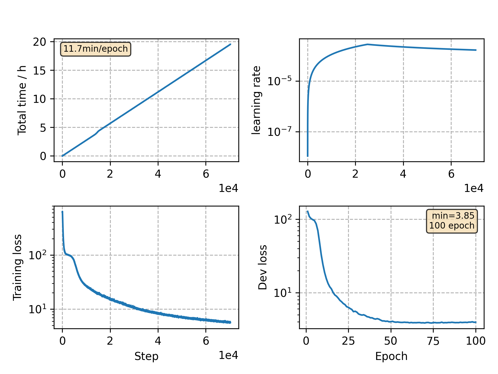

### Basic info

**This part is auto generated, add your details in Appendix**

* Model size/M: 90.33
* GPU info \[9\]
  * \[9\] GeForce RTX 3090

### Appendix

* `v5` + remove gradient clipping + attention dropout 0.3 -> 0.2
* or `v7` + attention dropout 0.2 -> 0.1

### WER
```
Use CPU = False
test %WER 12.19 [7856 / 64428, 1139 ins, 611 del, 6106 sub ]
%CER 6.04 [6325 / 104765, 182 ins, 126 del, 6017 sub ]

Custom checkpoint: avg_best_10.pt
Use CPU = False
test %WER 11.43 [7365 / 64428, 933 ins, 630 del, 5802 sub ]
%CER 5.58 [5842 / 104765, 110 ins, 125 del, 5607 sub ]

Custom checkpoint: avg_last_10.pt
Use CPU = False
test %WER 11.14 [7179 / 64428, 926 ins, 588 del, 5665 sub ]
%CER 5.48 [5742 / 104765, 107 ins, 122 del, 5513 sub ]
```

### Monitor figure

