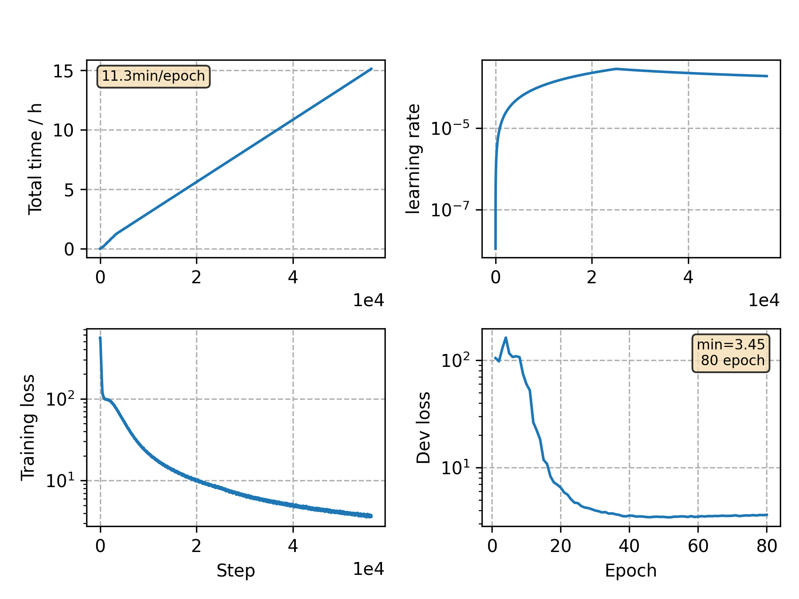

### Basic info

**This part is auto generated, add your details in Appendix**

* Model size/M: 90.33
* GPU info \[9\]
  * \[9\] GeForce RTX 3090

### Appendix

* `v10` + disable time warp, stop at 80 epochs

### WER
```
test    %CER 5.19 [5442 / 104765, 181 ins, 124 del, 5137 sub ]
test    %CER 3.99 [4181 / 104765, 122 ins, 117 del, 3942 sub ]
```

### Monitor figure

