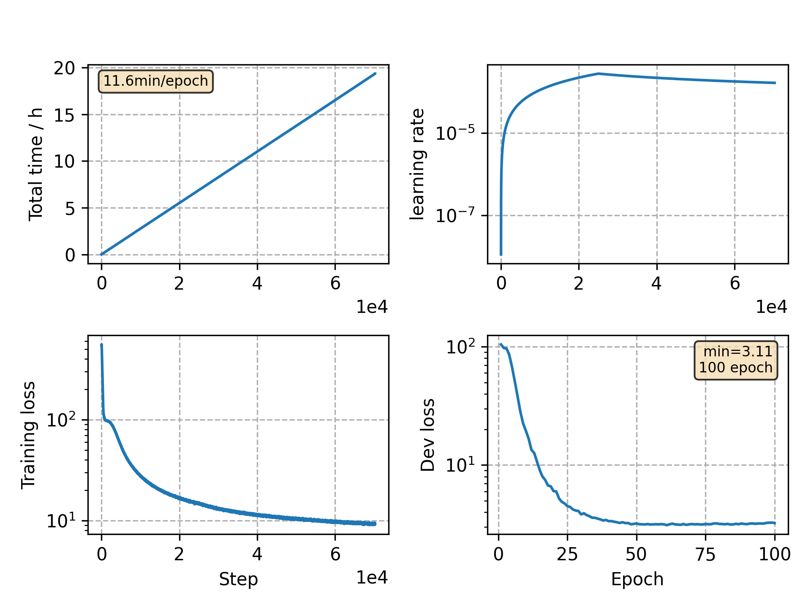

### Basic info

**This part is auto generated, add your details in Appendix**

* Model size/M: 90.33
* GPU info \[9\]
  * \[9\] GeForce RTX 3090

### Appendix

* `v12` + PN mask ratio: 0.2 -> 0.3, No. PN mask: 4 -> 3, stop epochs: 80 -> 100

### WER
```
test    %CER 4.81 [5039 / 104765, 170 ins, 150 del, 4719 sub ]
test    %CER 3.53 [3693 / 104765, 97 ins, 127 del, 3469 sub ]
```

### Monitor figure

