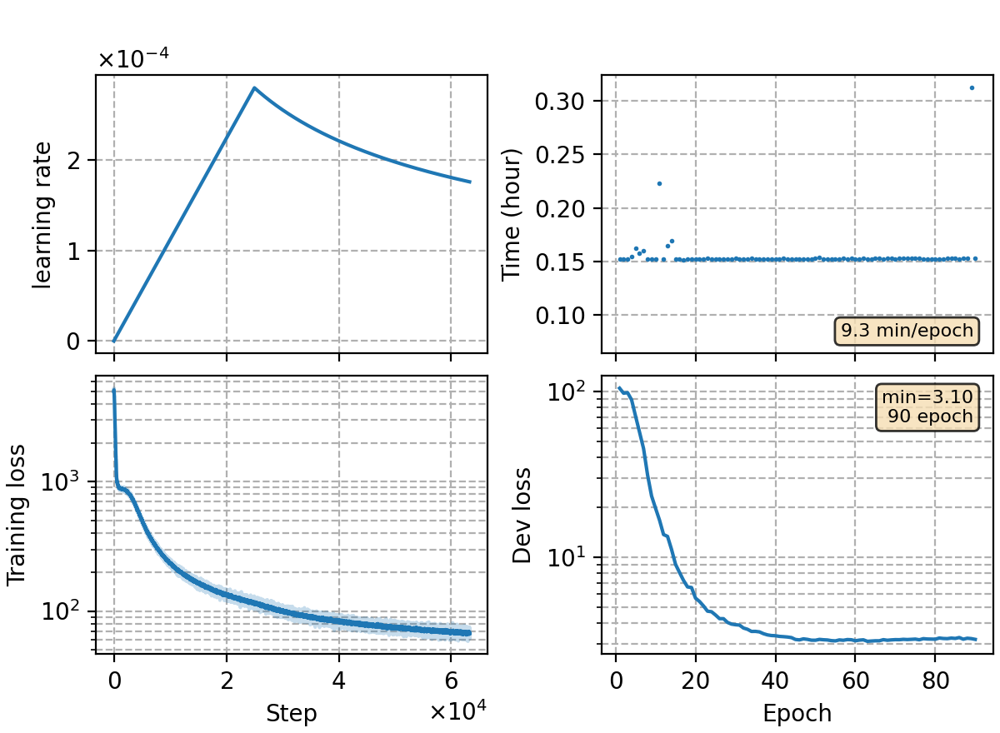

### Basic info

**This part is auto-generated, add your details in Appendix**

* Model size/M: 84.30
* GPU info \[9\]
  * \[9\] NVIDIA GeForce RTX 3090

### Appendix

* `v14` + bos token

### Result
```
rna 128
dev     %SER 34.23 | %CER 4.44 [ 9107 / 205341, 238 ins, 183 del, 8686 sub ]
test    %SER 35.97 | %CER 4.80 [ 5032 / 104765, 135 ins, 131 del, 4766 sub ]

+lm-v5 (5gram char)
%SER 33.30 | %CER 4.34 [ 8916 / 205341, 217 ins, 197 del, 8502 sub ]    [0.15625, 0.5]
%SER 34.98 | %CER 4.68 [ 4905 / 104765, 110 ins, 165 del, 4630 sub ]    [0.15625, 0.25]

+lm-v6 (3gram word)
%SER 31.48 | %CER 4.10 [ 8417 / 205341, 166 ins, 271 del, 7980 sub ]    [0.15625, -1.0]
%SER 32.50 | %CER 4.42 [ 4627 / 104765, 77 ins, 222 del, 4328 sub ]     [0.28125, -0.5]
```

### Monitor figure

