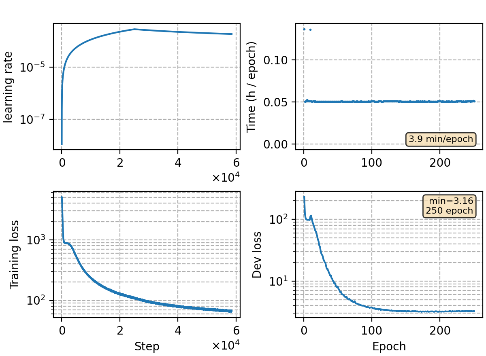

### Basic info

**This part is auto-generated, add your details in Appendix**

* Model size/M: 84.30
* GPU info \[9\]
  * \[9\] NVIDIA GeForce RTX 3090

### Appendix

* training aishell with torchaudio prepared feats (80 FBank, no CMVN)

### Result
```
beam 16
dev     %SER 34.17 | %CER 4.44 [ 9124 / 205341, 244 ins, 196 del, 8684 sub ]
test    %SER 36.44 | %CER 4.88 [ 5108 / 104765, 122 ins, 156 del, 4830 sub ]
```

### Monitor figure

