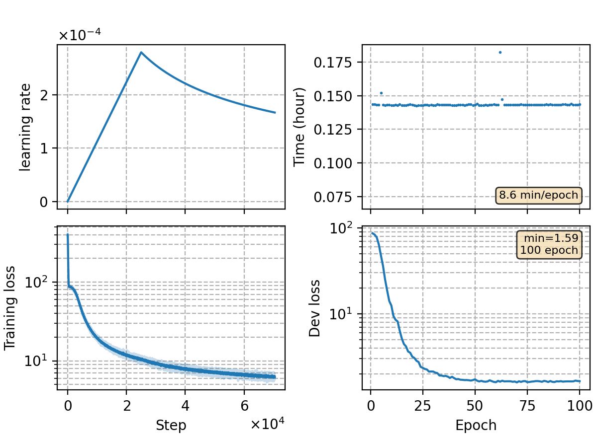

### Basic info

**This part is auto-generated, add your details in Appendix**

* Model size/M: 84.30
* GPU info \[10\]
  * \[10\] NVIDIA GeForce RTX 3090

### Appendix

* configurations ported from rnnt-v15
* use sampled softmax in joinet
* peak GPU memory usage (test on aishell-1 dev) decreases by 10~20%
* performance is much worse than the full-softmax `rnnt-v15` 

### Result
```
dev     %SER 37.04 | %CER 5.02 [ 10314 / 205341, 237 ins, 139 del, 9938 sub ]
test    %SER 38.95 | %CER 5.46 [ 5717 / 104765, 123 ins, 114 del, 5480 sub ]
```

### Monitor figure

