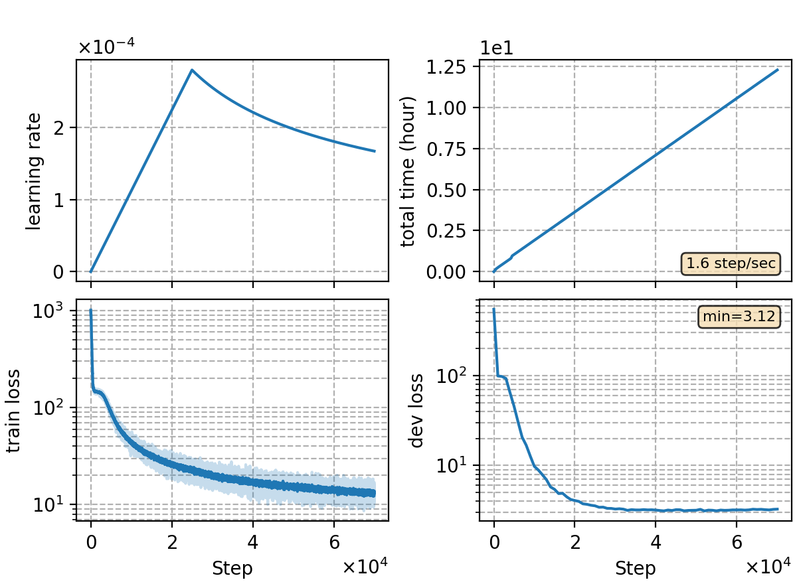

### Basic info

**This part is auto-generated, add your details in Appendix**

* Model size/M: 84.30
* GPU info \[10\]
  * \[10\] NVIDIA GeForce RTX 3090

### Appendix

* ported from rnnt-v15
* use torchaudio for feature extraction w/o CMVN

### Result

compared to baseline `rnnt-v15`

| model               | dev  | test |
| ------------------- | ---- | ---- |
| kaldi prep w/ CMVN  | 4.44 | 4.80 |
| torchaudio w/o CMVN | 4.43 | 4.76 | 

```
dev     %SER 33.79 | %CER 4.43 [ 9104 / 205341, 154 ins, 250 del, 8700 sub ]
test    %SER 35.14 | %CER 4.76 [ 4989 / 104765, 68 ins, 195 del, 4726 sub ]
```

### Monitor figure

