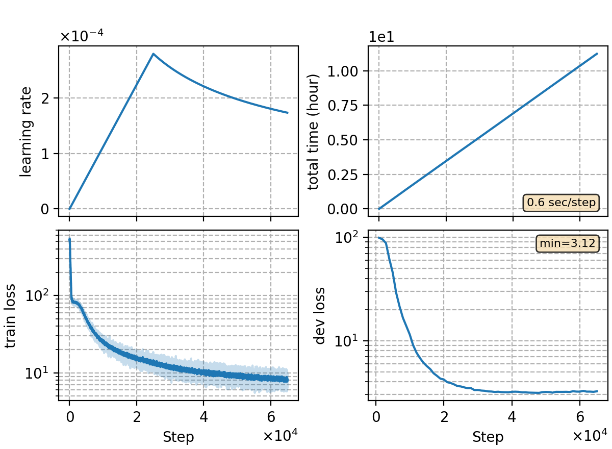

### Basic info

**This part is auto-generated, add your details in Appendix**

* Model size/M: 84.30
* GPU info \[8\]
  * \[8\] NVIDIA GeForce RTX 3090

### Appendix

* ported `rnnt/rnnt-v15`, test bucket loader

### Result
```
dev     %SER 33.88 | %CER 4.47 [ 9174 / 205341, 143 ins, 314 del, 8717 sub ]
test    %SER 35.80 | %CER 4.81 [ 5035 / 104765, 70 ins, 229 del, 4736 sub ]

+lm-v5 5-gram char SF a=0.16 b=0.5
dev     %SER 33.34 | %CER 4.45 [ 9136 / 205341, 136 ins, 456 del, 8544 sub ]
test    %SER 35.31 | %CER 4.73 [ 4954 / 104765, 61 ins, 317 del, 4576 sub ]
```

### Monitor figure

