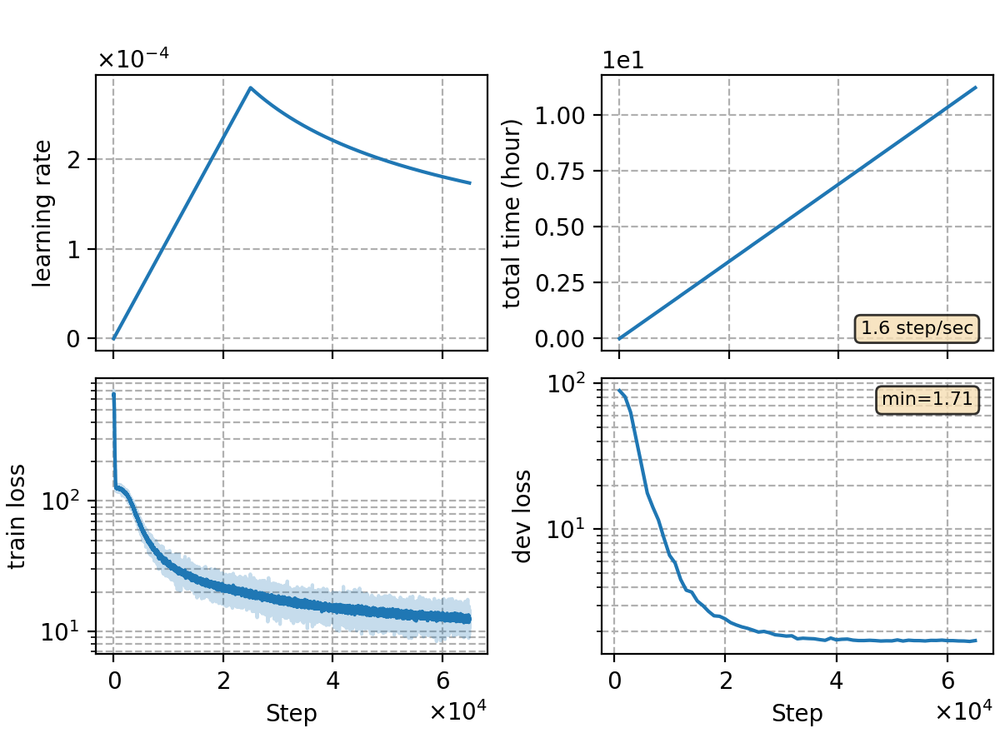

### Basic info

**This part is auto-generated, add your details in Appendix**

* \# of parameters (million): 84.30
* GPU info \[8\]
  * \[8\] NVIDIA GeForce RTX 3090

### Notes

* ported from `rnnt/rnnt-v21`
* test sampled softmax in updating codes.
* no significant time reduction of training observed.

| Exp  | dev  | test |
| ---- | ---- | ---- |
| v21  | 4.47 | 4.81 |
| this | 5.08 | 5.50 |

### Result
```
dev     %SER 37.07 | %CER 5.08 [ 10422 / 205341, 161 ins, 203 del, 10058 sub ]
test    %SER 39.14 | %CER 5.50 [ 5766 / 104765, 69 ins, 161 del, 5536 sub ]
```

|     training process    |
|:-----------------------:|
||
