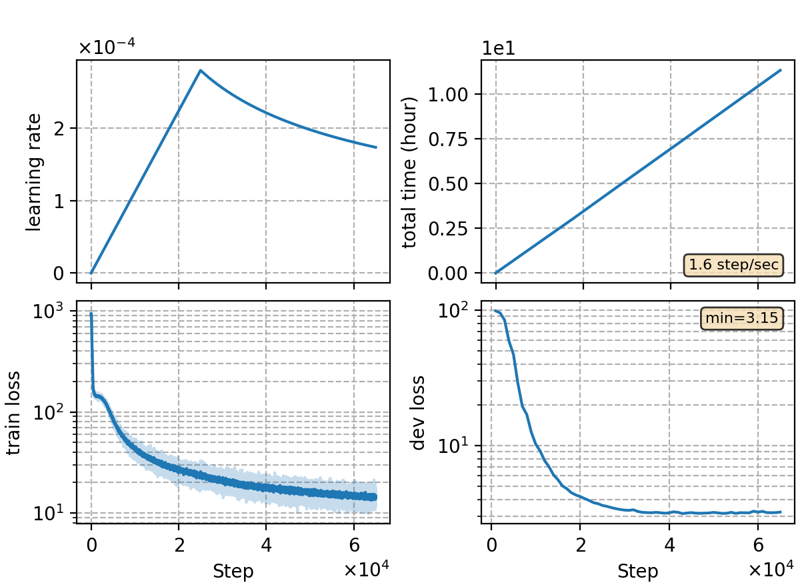

### Basic info

**This part is auto-generated, add your details in Appendix**

* \# of parameters (million): 84.88
* GPU info \[8\]
  * \[8\] NVIDIA GeForce RTX 3090

### Notes

* ported from `rnnt/rnnt-v21`, preditor embedding with syllables.

| Exp  | dev  | test |
| ---- | ---- | ---- |
| v21  | 4.47 | 4.81 |
| this | 4.43 | 4.75 |

### Result
```
dev     %SER 34.11 | %CER 4.43 [ 9091 / 205341, 160 ins, 309 del, 8622 sub ]
test    %SER 35.93 | %CER 4.75 [ 4980 / 104765, 80 ins, 207 del, 4693 sub ]

+lm-v5 5-gram char SF a=0.16 b=0.5
dev     %SER 33.35 | %CER 4.39 [ 9017 / 205341, 146 ins, 398 del, 8473 sub ]
test    %SER 35.17 | %CER 4.71 [ 4930 / 104765, 71 ins, 275 del, 4584 sub ]
```

|     training process    |
|:-----------------------:|
||
