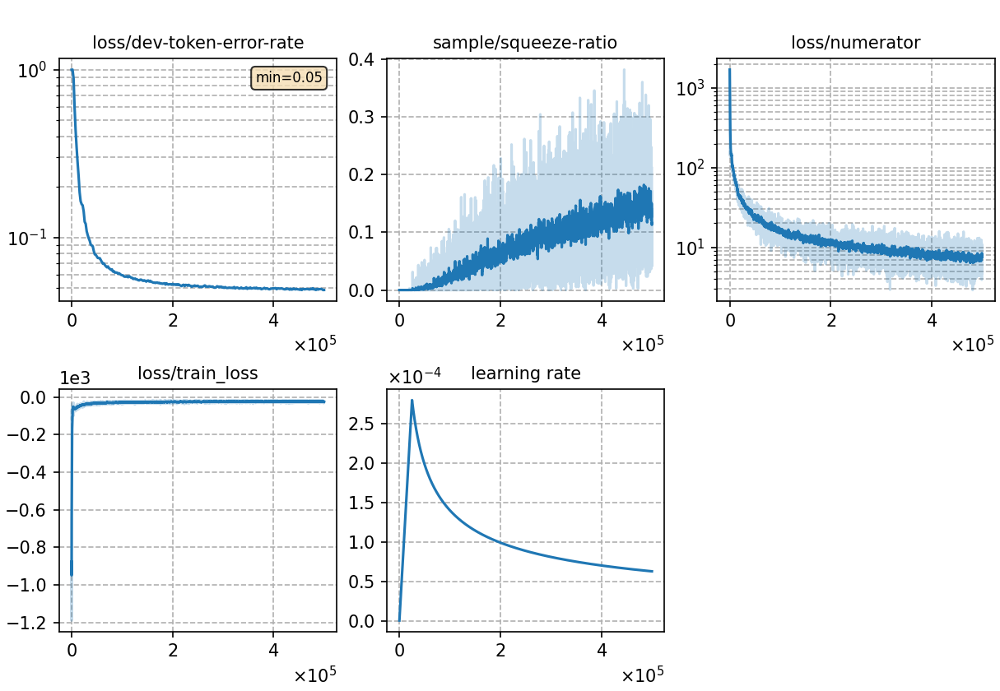

### Basic info

**This part is auto-generated, add your details in Appendix**

* \# of parameters (million): 79.50
* GPU info \[6\]
  * \[6\] NVIDIA GeForce RTX 3090

### Notes

* ctc-scrf with error (prior lm weight always be 1) fixed

### Result
```
no lm
dev     %SER 40.31 | %CER 5.18 [ 10646 / 205341, 224 ins, 131 del, 10291 sub ]
test    %SER 43.65 | %CER 5.81 [ 6083 / 104765, 122 ins, 111 del, 5850 sub ]

0.3 trans. lm
dev     %SER 35.32 | %CER 4.61 [ 9470 / 205341, 164 ins, 152 del, 9154 sub ]
test    %SER 37.40 | %CER 5.08 [ 5317 / 104765, 75 ins, 131 del, 5111 sub ]

0.45 5-gram char lm
dev     %SER 34.79 | %CER 4.57 [ 9381 / 205341, 148 ins, 154 del, 9079 sub ]
test    %SER 37.03 | %CER 5.05 [ 5293 / 104765, 70 ins, 141 del, 5082 sub ]

0.4 3-gram word lm
dev     %SER 32.00 | %CER 4.21 [ 8641 / 205341, 147 ins, 149 del, 8345 sub ]
test    %SER 34.49 | %CER 4.70 [ 4921 / 104765, 73 ins, 132 del, 4716 sub ]
```

|     training process    |
|:-----------------------:|
||
