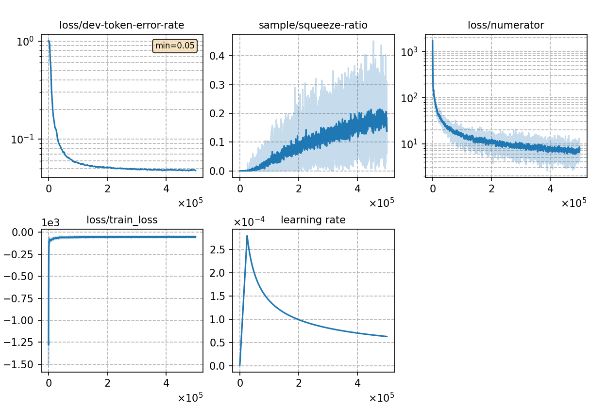

### Basic info

**This part is auto-generated, add your details in Appendix**

* \# of parameters (million): 79.50
* GPU info \[6\]
  * \[6\] NVIDIA GeForce RTX 3090

### Notes

* kaldi w/o CMVN + sp

### Result
```
no lm
dev     %SER 40.28 | %CER 5.15 [ 10569 / 205341, 264 ins, 120 del, 10185 sub ]
test    %SER 43.87 | %CER 5.76 [ 6037 / 104765, 157 ins, 94 del, 5786 sub ]

5-gram char 0.5
dev     %SER 34.34 | %CER 4.46 [ 9164 / 205341, 177 ins, 146 del, 8841 sub ]
test    %SER 35.77 | %CER 4.80 [ 5032 / 104765, 81 ins, 123 del, 4828 sub ]

3-gram word 0.5
dev     %SER 31.58 | %CER 4.11 [ 8443 / 205341, 178 ins, 141 del, 8124 sub ]
test    %SER 33.44 | %CER 4.53 [ 4750 / 104765, 89 ins, 113 del, 4548 sub ]
```

|     training process    |
|:-----------------------:|
||
