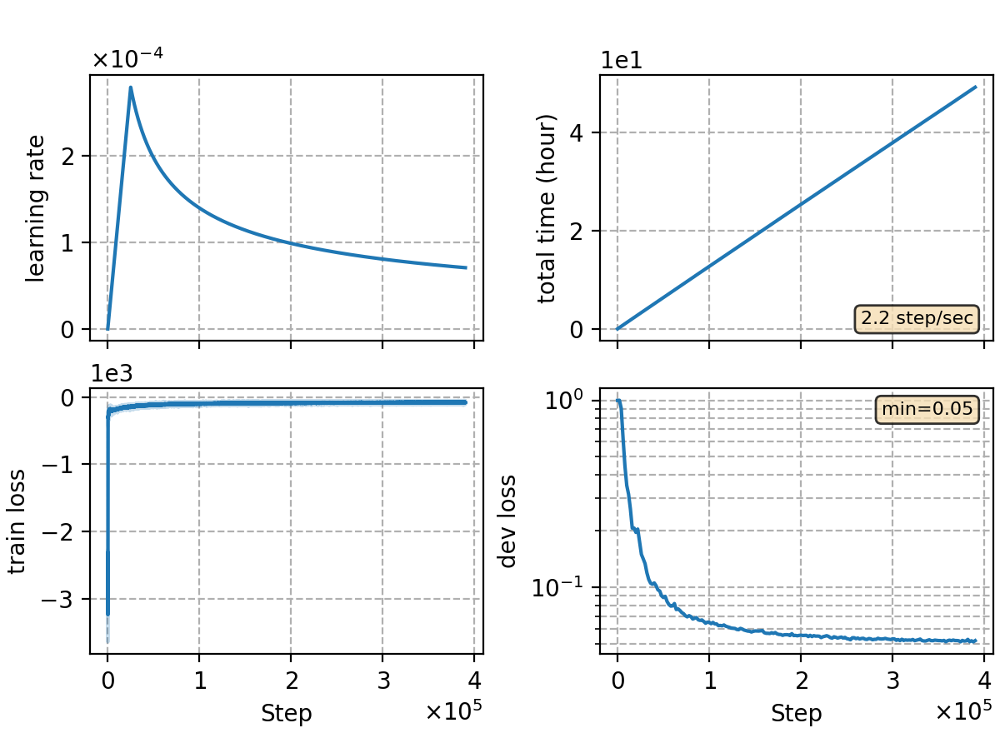

### Basic info

**This part is auto-generated, add your details in Appendix**

* \# of parameters (million): 79.50
* GPU info \[7\]
  * \[7\] NVIDIA GeForce RTX 3090

### Notes

* 

### Result
```
no lm
dev   %SER 43.82 | %CER 5.67 [ 11646 / 205341, 235 ins, 141 del, 11270 sub ]
test  %SER 47.32 | %CER 6.41 [ 6711 / 104765, 148 ins, 116 del, 6447 sub ]

trans. lm 0.5
dev     %SER 37.18 | %CER 4.93 [ 10131 / 205341, 159 ins, 166 del, 9806 sub ]
test    %SER 38.82 | %CER 5.35 [ 5602 / 104765, 67 ins, 151 del, 5384 sub ]

5-gram char 0.5
dev     %SER 35.92 | %CER 4.82 [ 9892 / 205341, 155 ins, 169 del, 9568 sub ]
test    %SER 38.14 | %CER 5.27 [ 5522 / 104765, 70 ins, 154 del, 5298 sub ]

3-gram word 0.5
dev     %SER 33.67 | %CER 4.51 [ 9268 / 205341, 167 ins, 163 del, 8938 sub ]
test    %SER 36.09 | %CER 5.00 [ 5238 / 104765, 74 ins, 147 del, 5017 sub ]
```

|     training process    |
|:-----------------------:|
||
