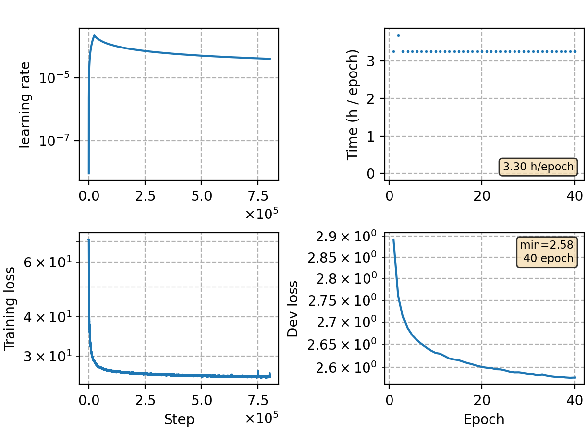

### Basic info

**This part is auto-generated, add your details in Appendix**

* Model size/M: 87.42
* GPU info \[10\]
  * \[10\] NVIDIA GeForce RTX 3090

### Appendix

* derived from `lm-v9`, change truncate way and fixed [huggingface bug](https://github.com/huggingface/transformers/issues/15199)

### Result
```
> Resuming from: exp/lm-v10/checks/bestckpt.pt
Perplexity over dataset is 13.25

> Resuming from: exp/lm-v10/checks/best-10.pt
Perplexity over dataset is 13.13
```

### Monitor figure

