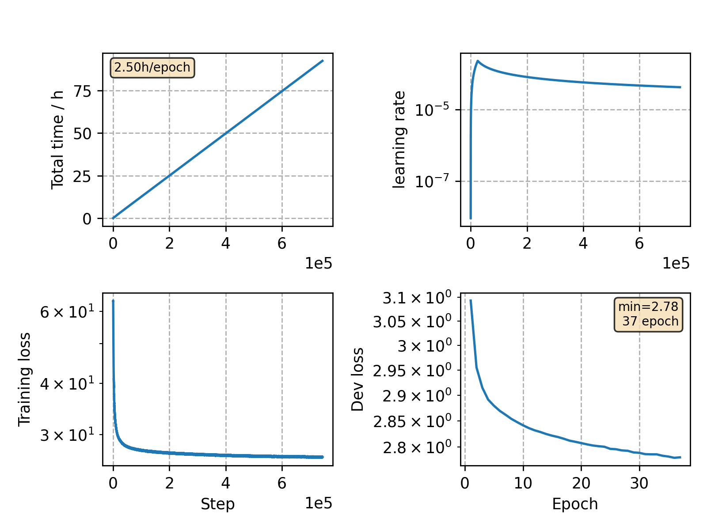

### Basic info

**This part is auto-generated, add your details in Appendix**

* Model size/M: 67.74
* GPU info \[9\]
  * \[9\] NVIDIA GeForce RTX 3090

### Appendix

* large corpus, transformer LM

### Result
```
test ppl: 17.93
```

### Monitor figure


commit: `812b407dadde44213e49d4a77a9ea1c107a9e190`
