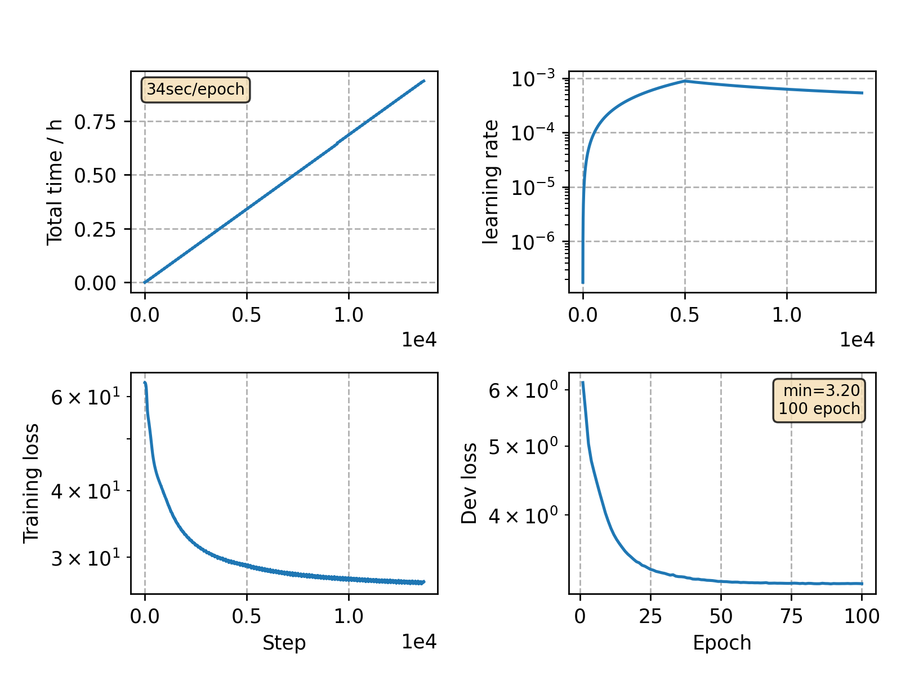

### Basic info

**This part is auto-generated, add your details in Appendix**

* Model size/M: 10.27
* GPU info \[9\]
  * \[9\] NVIDIA GeForce RTX 3090

### Appendix

* use hugging face package to train transformer

### Result
```
Perplexity over dataset is 27.39
```

### Monitor figure

