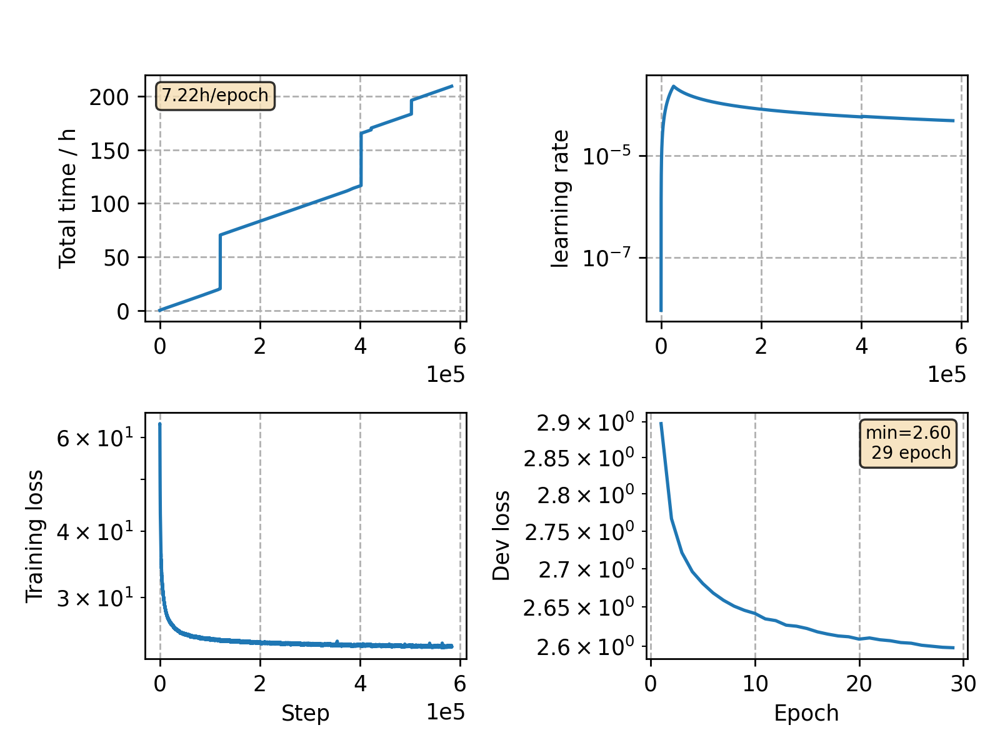

### Basic info

**This part is auto-generated, add your details in Appendix**

* Model size/M: 87.42
* GPU info \[9\]
  * \[9\] NVIDIA GeForce RTX 3090

### Appendix

* trained 35 epochs
* '36 epochs' in the figure is due to some plotting error.

### Result
```
Perplexity over dataset is 
word piece level: 15.44
word level: ~ 86.63  (exp(log(15.44)*180796/110909))
```

### Monitor figure

