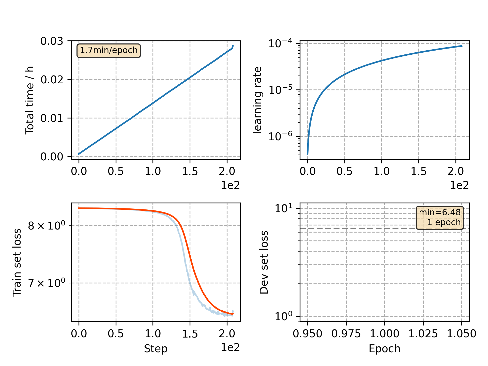

### Basic info

**This part is auto generated, add your details in Appendix**

* Model size/M: 13.06
* GPU info \[5\]
  * \[5\] GeForce RTX 3090

### Appendix

* incompatible with new `*_process.py`

### WER
```
lm=0.0
%WER 5.55 [ 2919 / 52576, 518 ins, 269 del, 2132 sub ]
%WER 12.47 [ 6526 / 52343, 927 ins, 701 del, 4898 sub ]
%WER 5.05 [ 2750 / 54402, 460 ins, 251 del, 2039 sub ]
%WER 12.42 [ 6328 / 50948, 805 ins, 696 del, 4827 sub ]

lm=0.1
%WER 5.34 [ 2810 / 52576, 497 ins, 283 del, 2030 sub ]
%WER 12.10 [ 6331 / 52343, 888 ins, 727 del, 4716 sub ]
%WER 4.91 [ 2669 / 54402, 425 ins, 251 del, 1993 sub ]
%WER 11.98 [ 6106 / 50948, 785 ins, 686 del, 4635 sub ]
```

### Monitor figure

