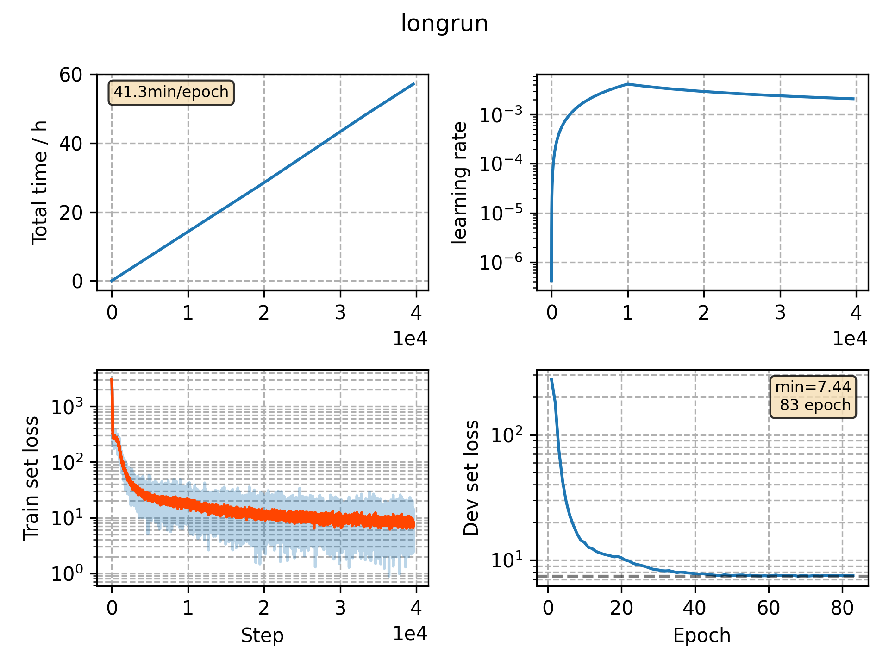

### Basic info

**This part is auto generated, add your details in Appendix**

* Model size/M: 13.06
* GPU info \[5\]
  * \[5\] GeForce RTX 3090

### Appendix

* 

### WER
```
%WER 5.55 [ 2919 / 52576, 518 ins, 269 del, 2132 sub ]
%WER 12.47 [ 6526 / 52343, 927 ins, 701 del, 4898 sub ]
%WER 5.05 [ 2750 / 54402, 460 ins, 251 del, 2039 sub ]
%WER 12.42 [ 6328 / 50948, 805 ins, 696 del, 4827 sub ]
```

### Monitor figure

