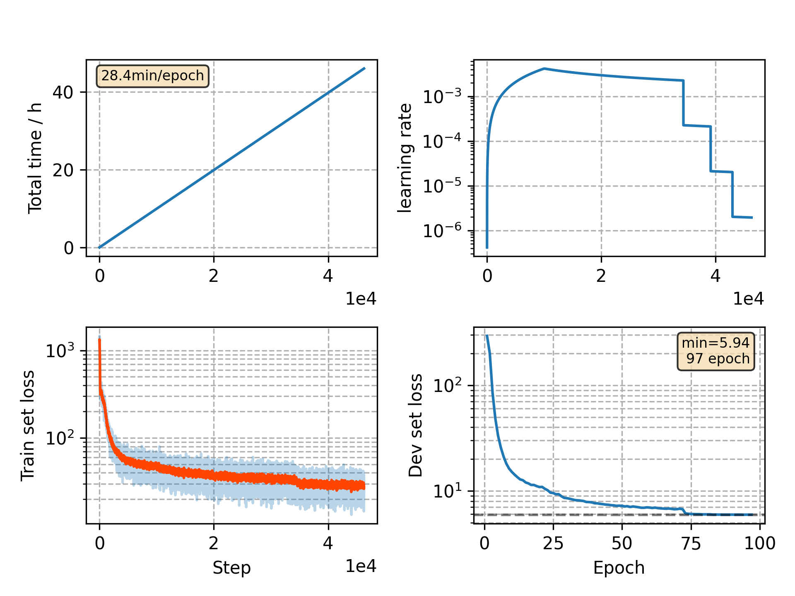

### Basic info

**This part is auto generated, add your details in Appendix**

* Model size/M: 10.65
* GPU info \[5\]
  * \[5\] GeForce RTX 3090

### Appendix

* 

### WER
```
lm=0.1
%WER 5.08 [ 2669 / 52576, 563 ins, 197 del, 1909 sub ]
%WER 10.96 [ 5735 / 52343, 990 ins, 463 del, 4282 sub ]
%WER 4.51 [ 2454 / 54402, 481 ins, 173 del, 1800 sub ]
%WER 10.97 [ 5588 / 50948, 823 ins, 463 del, 4302 sub ]
```

### Monitor figure

