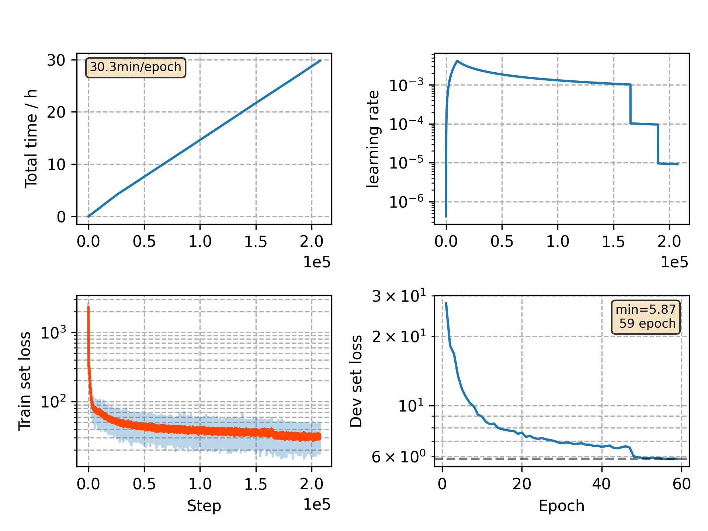

### Basic info

**This part is auto generated, add your details in Appendix**

* Model size/M: 10.65
* GPU info \[5\]
  * \[5\] GeForce RTX 3090

### Appendix

* v14 + combine tr95 and cv05, use dev_clean/dev_other as dev, small batch size, weight decay, no time warp, no time reduction

### WER
```
lm=0.0
%WER 5.51 [ 2895 / 52576, 534 ins, 256 del, 2105 sub ]
%WER 12.12 [ 6345 / 52343, 941 ins, 614 del, 4790 sub ]
%WER 5.16 [ 2806 / 54402, 468 ins, 234 del, 2104 sub ]
%WER 12.18 [ 6203 / 50948, 805 ins, 582 del, 4816 sub ]
```

### Monitor figure

