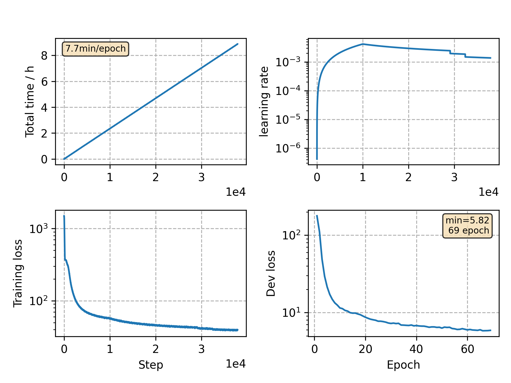

### Basic info

**This part is auto generated, add your details in Appendix**

* Model size/M: 10.33
* GPU info \[9\]
  * \[9\] GeForce RTX 3090

### Appendix

* `v19` + peak factor 1.0 -> 5.0
* stop criterion is eased

### WER
```
%WER 4.50 [ 2367 / 52576, 308 ins, 157 del, 1902 sub ]
%WER 10.76 [ 5630 / 52343, 725 ins, 467 del, 4438 sub ]
```

### Monitor figure

