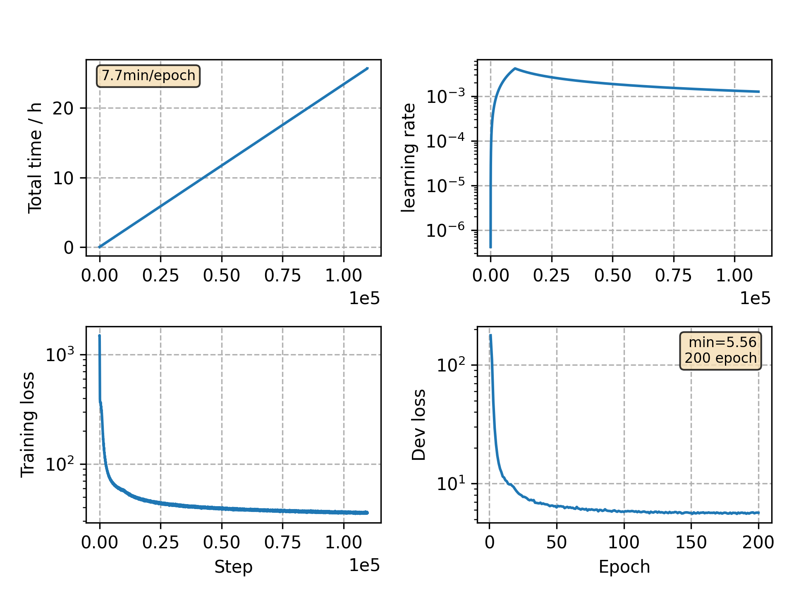

### Basic info

**This part is auto generated, add your details in Appendix**

* Model size/M: 10.33
* GPU info \[9\]
  * \[9\] GeForce RTX 3090

### Appendix

* `v20` + 200 epochs

### WER
```
test_clean %WER 4.05 [2127 / 52576, 284 ins, 154 del, 1689 sub ]
test_other %WER 10.03 [5249 / 52343, 602 ins, 413 del, 4234 sub ]

# average over last 10
test_clean %WER 3.81 [2002 / 52576, 259 ins, 137 del, 1606 sub ]
test_other %WER 9.38 [4912 / 52343, 601 ins, 386 del, 3925 sub ]

# average over last 5
test_clean %WER 3.88 [2041 / 52576, 257 ins, 153 del, 1631 sub ]
test_other %WER 9.56 [5006 / 52343, 621 ins, 394 del, 3991 sub ]
```

### Monitor figure

