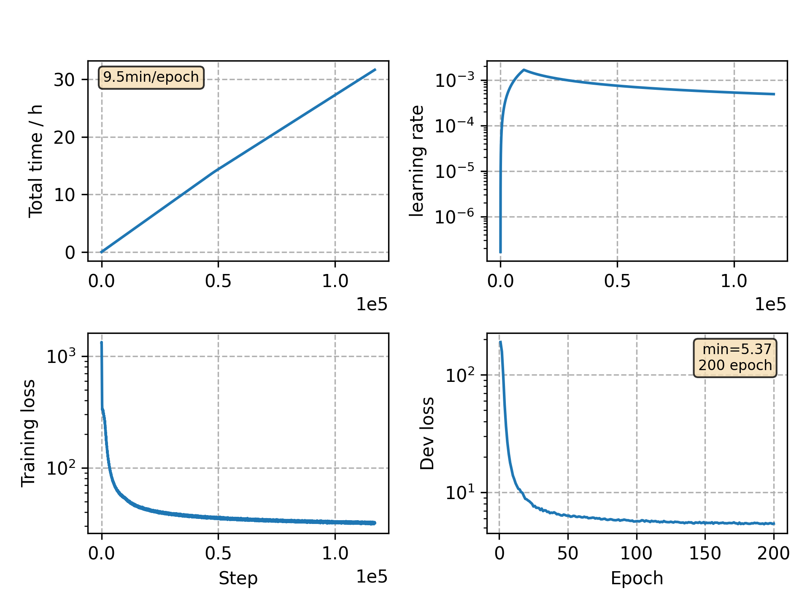

### Basic info

**This part is auto generated, add your details in Appendix**

* Model size/M: 10.33
* GPU info \[9\]
  * \[9\] GeForce RTX 3090

### Appendix

* `v21` + fix distributed sampler bug

### WER
```
Use CPU = False
dev_other %WER 9.67 [4925 / 50948, 509 ins, 389 del, 4027 sub ]
test_clean %WER 3.75 [1971 / 52576, 238 ins, 144 del, 1589 sub ]
test_other %WER 9.50 [4971 / 52343, 615 ins, 371 del, 3985 sub ]

Custom checkpoint: avg_best_10.pt
Use CPU = False
dev_other %WER 9.31 [4742 / 50948, 532 ins, 357 del, 3853 sub ]
test_clean %WER 3.65 [1921 / 52576, 231 ins, 138 del, 1552 sub ]
test_other %WER 9.01 [4714 / 52343, 573 ins, 345 del, 3796 sub ]

Custom checkpoint: avg_199_10.pt
Use CPU = False
dev_other %WER 9.33 [4752 / 50948, 524 ins, 347 del, 3881 sub ]
test_clean %WER 3.64 [1914 / 52576, 233 ins, 143 del, 1538 sub ]
test_other %WER 9.13 [4777 / 52343, 577 ins, 342 del, 3858 sub ]
```

### Monitor figure

