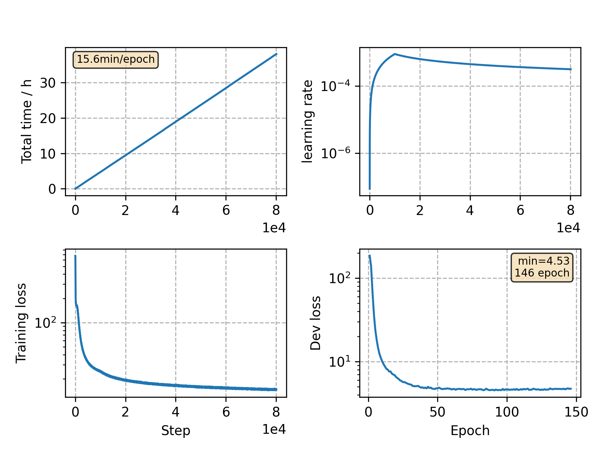

### Basic info

**This part is auto generated, add your details in Appendix**

* Model size/M: 81.01
* GPU info \[9\]
  * \[9\] GeForce RTX 3090

### Appendix

* same model as `v24`, but adjust scheduler lr
* seems overfitting after ~100 epoch training

### WER
```
Use CPU = False
test_clean ext_lm= %WER 3.01 [1581 / 52576, 215 ins, 106 del, 1260 sub ]
test_other ext_lm= %WER 7.46 [3907 / 52343, 441 ins, 318 del, 3148 sub ]

Custom checkpoint: avg_best_10.pt
Use CPU = False
test_clean ext_lm= %WER 2.70 [1420 / 52576, 184 ins, 104 del, 1132 sub ]
test_other ext_lm= %WER 6.70 [3509 / 52343, 392 ins, 287 del, 2830 sub ]

Custom checkpoint: avg_last_10.pt
Use CPU = False
test_clean ext_lm= %WER 2.71 [1426 / 52576, 164 ins, 108 del, 1154 sub ]
test_other ext_lm= %WER 6.56 [3433 / 52343, 393 ins, 295 del, 2745 sub ]
```

### Monitor figure


commit: `95bb394a0acdc7220c5a5e29eda30bf76bb4aff3`